# AURORA user documentation

AURORA – *A*rchive *U*pload *R*esearch *O*bjects for *R*etrieval and *A*lteration is a system for 
facilitating transport of science data generated in laboratories to a storage system and allowing 
sharing and moving of data to other locations for processing or further storing. It offers a rich 
and flexible way of attaching metadata to the stored datasets, including templating.

The system can be logged into from here:

https://www.aurora.it.ntnu.no

## Key features

- Data Management of datasets that have been created.
- The ability to download data from laboratory computers in the background after they have been generated (socalled automated acquire).
- The ability to download data from laboratory computers while its being generated (socalled manual acquire).
- The ability to add dynamic metadata to the stored datasets. The limit to the metadata is only in terms of database size and practical limits as it is completely flexible.
- A rich and flexible ability to define permissions for datasets, including adding them to research groups and other organizational units. This means that datasets will be owned by the group, not the user which makes the management of them better and safer.
- The ability to automatically copy the stored dataset on to other locations by policy.
- Offers an easy to use web-interface to the stored datasets, creating new datasets, viewing and editing metadata,
- Offers plugin support for transport protocols both from and to locations. The support now includes: FTP, SFTP, SCP, RSync over SSH and Samba/CIFS. In the future it will offer support for the most popular cloud platforms like OneDrive, Google Drive, Amazon S3 etc.
- Offers plugin support for dataset access/retrieval. The support now includes: Samba/CIFS, ZIP- and TAR-sets.
- Allows easy access to the datasets through established ways, such as samba shares (Windows explorer, Linux Nautilus, MacOS Finder etc.), ftp, sftp etc.
- Ability to perform dataset operations by clicking on shortcuts in the shares.
- Ability to manually add data to datasets through shares in samba/cifs, ftp, sftp etc.
- Supports most major platforms: Windows, Mac OS, Linux, Unix etc. Most functionality is available through web-interface or standardized transport and retrieval protocols.
- Better security for science laboratories by eliminating the need for external HDs or USB drives to move data out of the lab.
- Compatible with even Windows XP installations and Firefox 52. Supports major browsers of newer iterations (Chrome, Edge etc.).
- Automatic notification of upcoming removal and removed datasets. 
- Escalation of critical notifications in a hierarchical manner that have not been handled.
- Voting mechanisms upon critical dataset management decisions, such as removal.
- REST-interface to the AURORA-system that easily can allow new services and systems to access it.
- Free to use.

## Getting to use it

Everyone having lab computers can start to use the archive system provided they meet the necessary criteria (network access, support for a needed transport protocol etc.). Both internal NTNU users and external users are allowed.

Here are guides on how to get to use the AURORA-system both for users and computers/laboratories.

### By a user

For NTNU-users the ability to login and start using the system can be achieved by the user himself. This is done by going to the archive systems web address:

https://www.aurora.it.ntnu.no

and selecting “FEIDE login”. Log on with your username and password at NTNU. The AURORA-system will then create a user account automatically based on the credentials from FEIDE.

For users external to NTNU or who do not have access to a NTNU-account, they need to have either the IT-service or a someone with permissions to create users for the department in question. For the IT-services to add external users, please send an email to orakel@ntnu.no and include their first name, last name and email address and state that it concerns adding a user to the AURORA-system.

There are also some laboratories that have such a restricted network access that they cannot even reach the NTNU internet resources (except for the AURORA-system). These computers are not able to login using the FEIDE-authentication. Then the user needs to use his email-address in the AURORA-system and its password. The password for the AURORA-system itself can differ from 
the FEIDE/NTNU-password.

The password for a user can be changed inside the web-interface for the AURORA-system. Be aware that this will only change the password for the AURORA-system itself, not the FEIDE-account.

When an account is generated by the IT-services or someone with the permissions a password will be automatically generated and sent to the user. The user can then change this password him- or herself.

Furthermore, the user needs to have permission to create datasets on a socalled research group (or research area group, all dependant upon how it is organized). This permission can be arranged by the administrators of the various labs. To view datasets that others have created on a research group, the user will need separate rights for this. This can also be arranged by the administrators of the labs.

### By a laboratory computer

In order for a computer in a laboratory to be able to start using the AURORA-system and store its data there, it has to be registered by the IT-services. In addition we would need some information:

1. What monthly or yearly storage need do you foresee that the lab computer needs? We underline that the AURORA-system is mainly meant at this point as a system for transferring data out of the laboratory and attaching metadata to it. Other systems must be used for long term storage.
2. Who are going to be responsible for the lab computer (name, science group, department)?
3. Where is the computer/laboratory located (campus, building, room)?
4. What operating system is the computer running (Windows, Mac OS, Linux etc.)?
5. What is the computers descriptive name (usually follows the instrument it controls, eg. “QCM”, “NMR400” etc.)?
6. The hostname of the computer as used by the operating system.
7. What is the absolute path on the computer where the top folder of data will be stored (eg. “c:\program files\labsoftware\data”, “d:\data” etc.)?
8. What IP-address does the computer have?
9. If the computer is to be protected from the internet/outside of the NTNU network, we need to know the internet outlet number that it is connected to (usually written on the wall or network outlet with a label).

Collect this information and send a request to the IT-services in order for us to add the lab computer to the AURORA-system.

## User Interface

In many places of the AURORA web-client it is possible to both select values from a dropdown and type part of words of what you are searching for and have the dropdown come with the closest match. This makes it much easier to find what you are looking for if the dropdown has a lot of possible selections. 
You can also continue to use them as normal dropdowns without typing anything.

This functionality behaves a little bit different in various browsers, but should be pretty similar. In Firefox, Chrome and Edge you will also have an icon inside the input box of a arrow pointing downwards. This icon can be clicked in order to display the dropdown, Another way of using it as a dropdown is to first click to select the input box and then click again to get the dropdown choices.

This functionality is available in "***Create -> Group***", "***Create -> Computer***", "***Manage -> Modify -> Permissions -> Add***", "***Manage -> Modify ->Permissions -> Edit***", ""***Control -> Computer***" and many other places. Whereever you need to select from a dropdown it is a high likelihood you also can search by typing part of words:

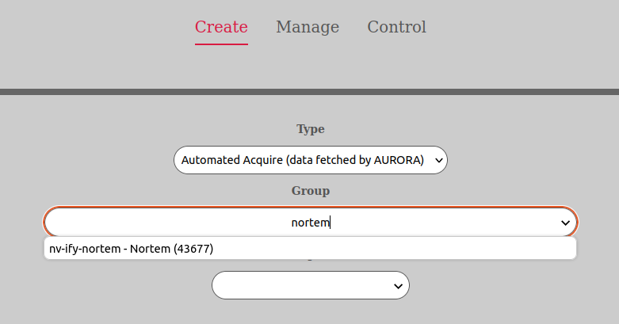

## Archiving datasets

There are two storage modes supported by the AURORA-system called automated acquire and manual acquire respectively. Automated acquire means that the dataset is retrieved after is has been created or finished. Manual acquire means that the data for the dataset is stored as it is being generated by the laboratory computer. Now, these two modes are not completely mutually exclusive as it is possible for a manual acquire-dataset to store its data several times over interrupted periods of time.

So the difference is that with an automated acquire-dataset the data is fetched in the background and after is has been generated. After the data has been fetched in the background the dataset is automatically closed by AURORA and no more data can be added.

With a manual acquire-dataset a storage area is opened in RW-mode when the dataset is created (typically available through Samba/CIFS). The user can then either at the same time as generating the data, store it on that storage area or he/she can copy data there in separate instances over time before manually closing the dataset. In any case the data will have to be put there in some way by the user (either manually or telling the software to store on a share to that area) and usually through eg. samba/CIFS. When the dataset is closed, no more data can be added to it, just as with the automated acquire-dataset.

After a dataset has been closed (both for automated acquire- and manual acquire- datasets) the distribution-phase of the data collection is executed. The data is then distributed to the locations specified in the policy for the computer in question. If no policy is defined, no distribution takes place. But the distribution phase enables the user or research group to automatically have the data distributed to other locations, either for storage and/or processing. Please note that if distribution happens or not, the data is still stored in the AURORA-system.

### Automated dataset

Automated acquire transfer or copying in the background after the data has been generated is performed in the following way:

1. Go to the "Create"-tab.
2. In the first window that appears, select the type of dataset (automated acquire), the group the dataset belong to and the computer that the dataset is created from.

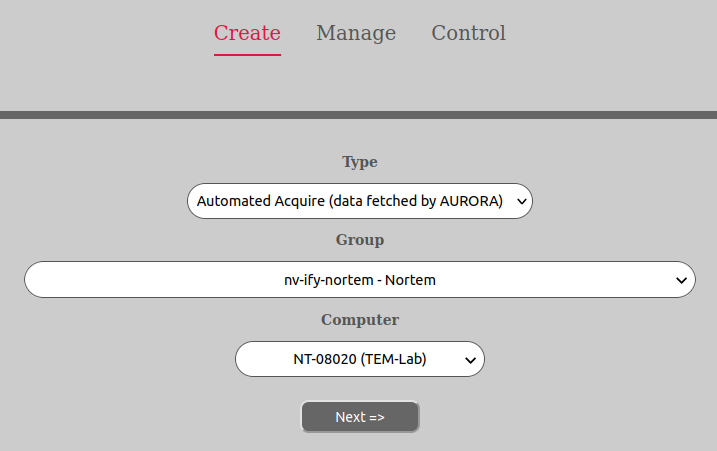

3. In the next window select which folder that is going to be archived from the lab computer. Browse the computer by clicking the relevant folder icons. You can sort the listing by name, size or date by clicking the header of those columns. The sorting order is either ascending or descending as shown by a upwards arrow (ascending) or downwards arrow (descending) on the column in question. Please note that folders are sorted first and put on top of the listing followed by files sorted on the bottom. If you choose to you can press the expand/collapse icon and write the path name manually. You are only able to write the part of the path that comes after the root folder of the storage area for the computer. When you have written or selected your path, press "Next".

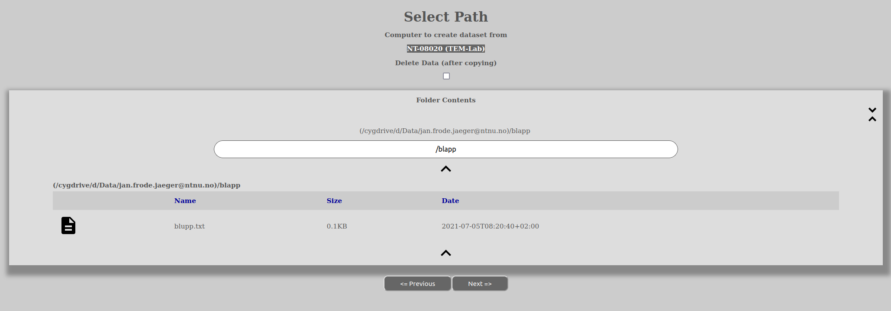

4. In the last window you will enter relevant metadata that needs to be set in order for the dataset to be created. The metadata that you enter will be checked for compliance with any metadata template and you will get feedback on which is in non-compliance and why. Make changes accordingly and press “create dataset” to create the dataset (or get another non-compliance feedback).

We generally recommend that you fill in the "Description"-field as a minimum beyond what might be mandatory by the template.

Mandatory fields will be shown with an orange coloring.

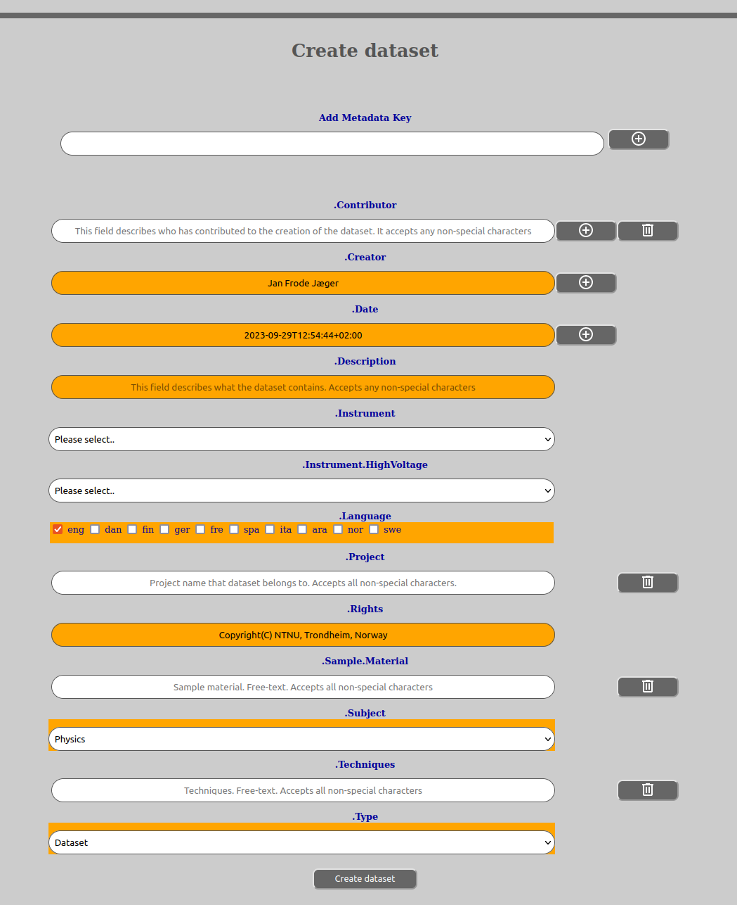

5. Fill in the necessary information and hit "create dataset". If all the metadata was entered correctly you will get a message saying the dataset has been created:

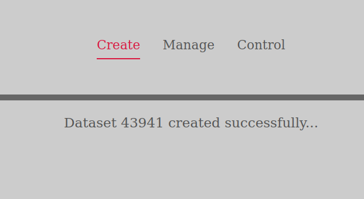

6. If you have non-compliance on any of the metadata, this will manifest itself as a red coloring of the field. 

Information about the field can always be gotten for fields that have it by clicking on the title of the field. It will show constraints that are in effect for the field. 

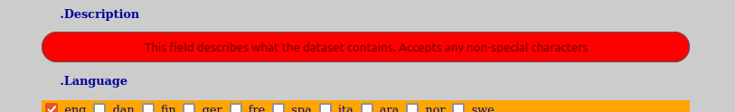

### Manual dataset

Manual acquire transfer is the copying of data while it is being generated. But it also allows for adding data over several separate instances in time and requires the user to manually close the dataset. It is done in the following manner:

1. Go to the "Create"-tab.
2. In the first window that appears, select the type of dataset (manual acquire), the group the dataset belong to and the computer that the dataset is created from.

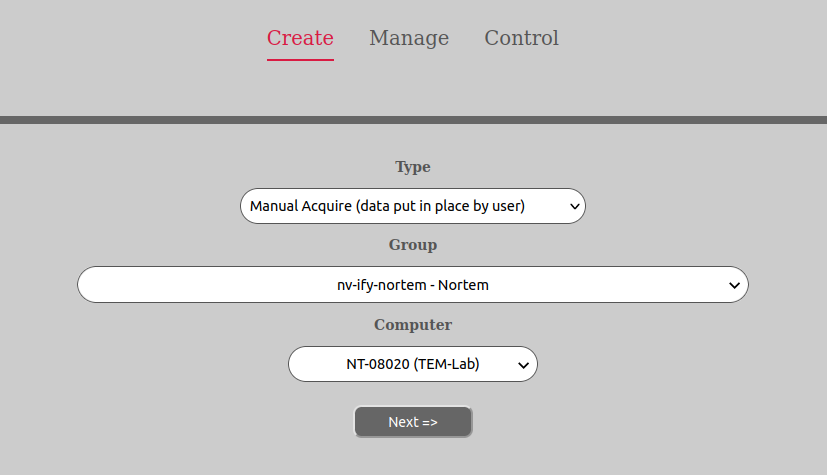

3. In the last window you will enter relevant metadata that needs to be set in order for the dataset to be created. The metadata that you enter will be checked for compliance with any metadata template and you will get feedback on which is in non-compliance and why. Make changes accordingly and press “Create Dataset” to create the dataset (or get another non-compliance feedback). We generally recommend that you fill in the "Description"-field as a minimum beyond what might be mandatory by the template.

If all the metadata was entered correctly you will get a message saying the dataset has been created. 

4. If you have non-compliance on any of the metadata, this will manifest itself as a red coloring of input field.

You are always able to click on the field title and it will open a dialog that show you what constraints are in effect for the field. This will allow you to make proper corrections.

The user will now have a dataset that is created and in an open state. It can be accessed through any protocol that the AURORA-system offers for its storage area, but typically one would use Samba/CIFS (see chapter on the [FileInterface](#file-interface) for more information).

When you are finished transferring data to the manual acquire dataset, you need to close it by doing the following:

1. Go to the “Manage”-tab.
2. Locate the dataset in question from the list that appears and select “Modify” and then the choice “Close...”.
3. You will then be asked if it is OK to close the dataset? Select “Close” and you will get a message that says the dataset has been closed.

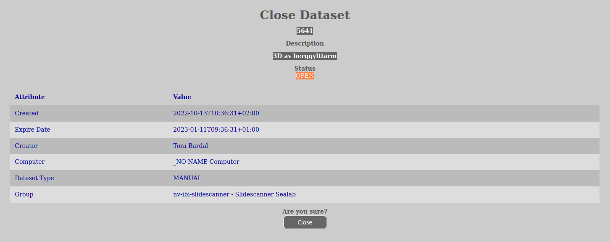

## Change user password

If the user has a need to change his or her password (in any of the available login methods, except FEIDE or any other external authentication authority) this is done by first logging into the AURORA-system and then doing the following:

1. Go to “Main Menu” and select “Change Authentication”.

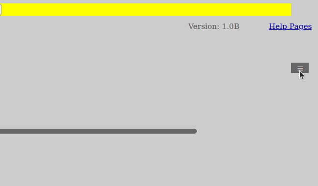

2. In the first window that appears select the authentication-type in question. Typically you should just select AuroraID, which is the native authentication type of the AURORA-system.
3. In the last window you will type the new password two times. Follow any instructions on the screen. When finished press “Change”.

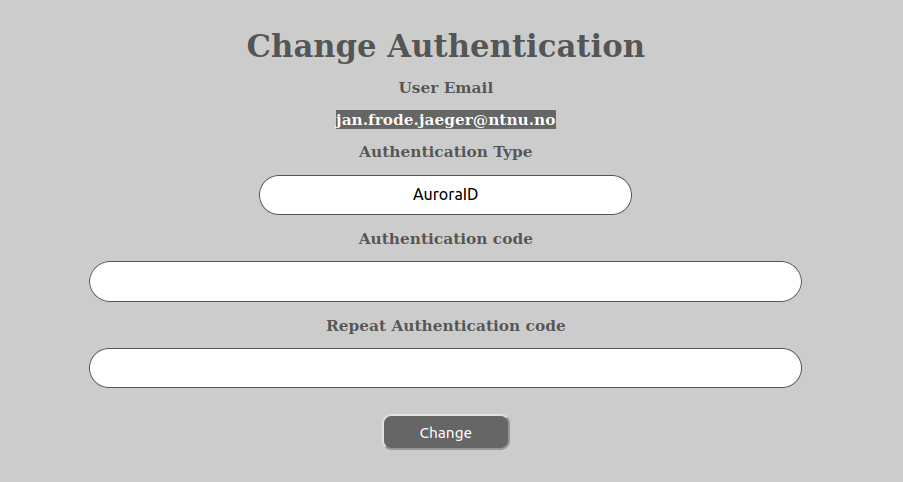

A message will appear confirming any password change.

Please note that the AURORA-system allows authentication to happen through several methods and that the password that are changed in this procedure is only for the main, internal Aurora credentials called AuroraID (if not any other was selected in the first window above).

For authentications methods that are trusted by AURORA and that happens through other services, like FEIDE, you have to change the password for that in the way prescribed by those systems. They will not affect the credentials for the other authentication methods.

## Manage datasets

To manage datasets that have been created go to the Manage-tab.

Here the user will see a list over the datasets that one has access to (to view, read data, read metadata etc.), moderated by potential search criterias.

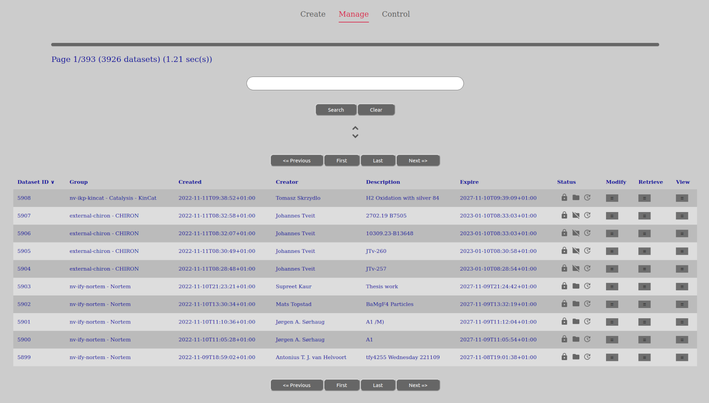

### Data columns

All entries in the "Manage Dataset" have a separate column for "Dataset ID". This is the unique identifier for a dataset in question and are used everywhere in the AURORA-system to identify it and it is even used by the file interface (such as on the Samba/CIFS-share).

Please also note that what choices are available in the drop-down menus in the "Manage Datasets" view (modify, retrieve or view) are entirely dependant upon what phase the dataset is in (open, closed, acquiring etc.) and what permissions the user has. To get more permissions than what you might already have - talk to the laboratory administrators or research group admin.

The status-column show icons for the state of the dataset. The dataset is either in an open (orange, open padlock) or closed (gray, closed padlock) state. Furthermore the data of the dataset is either present locally in AURORA (gray folder symbol) or not present locally in AURORA (gray, crossed out folder symbol). By being present locally means that the data is stored in any of AURORAs storage areas. If they are not present locally, they might still exist somewhere else outside of AURORA.

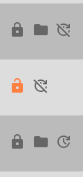

In addition there is a automated symbol (gray, round arrow with a hour- and minute hand in the center) that are either crossed out or not. If it is crossed out, it is a manual dataset and if it not crossed out it is automated. This will quickly tell the user what way of acquiring/storing data on the dataset has been selected at the time of creating it. Because of this It will also tell the user if the dataset is still waiting for data to be put manually to it while being open, versus an automated dataset still working on acquiring the data for it. It will also show why eg a "close"-option is not available for an automated set beyond a permission issue, since manual closing is only available for manual datasets. Automated datasets are closed by AURORA when it is finished transferring data in the acquire-phase.

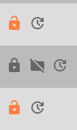

### Datetime format

The datetimes in the AURORA Web-client is shown in ISO-8601 format and with any timezone information that the client is able to get from the browser. If no timezone information is available or the timezone is 0 (effectively no offset), the time is displayed in UTC and postfixed with the letter "Z" for Zulu or UTC.

The ISO-8601 specification will show the time in the following way (all examples are the same datetime):

	2020-05-17T08:00:00Z
	2020-05-17T09:00:00+01:00
	2020-05-17T10:30:00+02:30

Here the year is first (2020), followed by the month (05) and ending in the day (17). Then a T-notifier comes signifying that the time comes, and the time is specified in normal 24-hour notation with hour:minute:second. The whole datetime is postfixed with the timezone information available (as required by the ISO-8601 specification).

The AURORA REST-server exlusively works in UTC-/unix-datetime, so any conversion going in and out of the server is done by the web-client. So any datetime coming from the REST-server has its timezone added or subtracted to the unix datetime before being converted and shown as ISO-time strings.

### How to change expire date

This option is dependant upon the user having the DATASET_DELETE-permission on the dataset in question and that the new expire date he seeks to set is allowed within the current lifespan policy in effect in the entity tree (see the [How to set dataset lifespan](#how-to-set-dataset-lifespan-policies) for more information on lifespans).

There are two stages at which an expire date can be set and those stages relates directly to the phases of a dataset:

- Open
- Closed

There is a separate policy for changing expire-dates when the dataset has the status OPEN as compared to when it has the status 
CLOSED.

For those users fortunate enough to have the *DATASET_EXTEND_UNLIMITED*-permission on the dataset in question can extend beyond 
any restrictions imposed by the lifespan-policies.

In order to change the expire date of a dataset, do the following:

1. Go to the "Manage Datasets" view in the web-client and find the row with the dataset in question.
2. Go to the column "Modify" and left-click the three horizontal lines and select "Expire Date...".
3. Left-click on the circular slider for either year, month or day. It will then be possible to adjust the value for the slider you chose. Left-click again to lock the value you chose. Change expire date according to your wishes and respecting the lifespan-policies. 
4. When finished adjusting the expire date, click the "Change"-button to make the changes take effect.

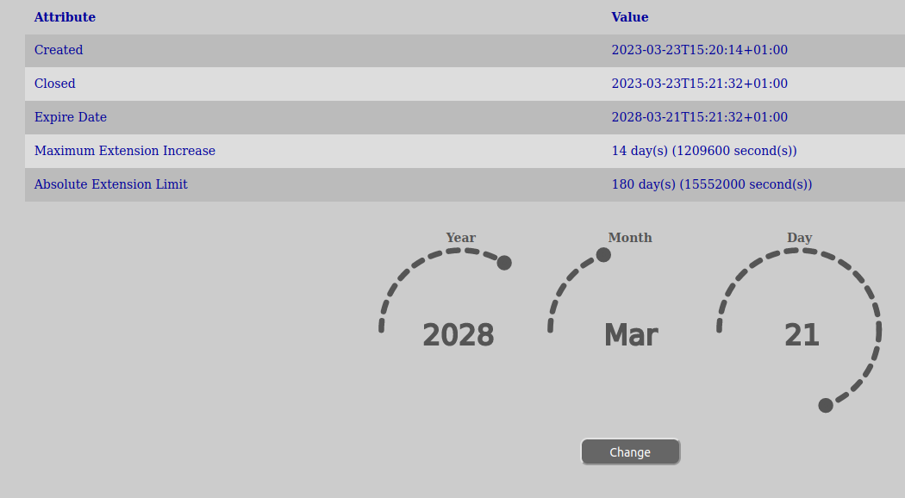

You will receive a feedback after clicking the change-button if it was ok or not and what the new date is.

### How to close dataset

This option is dependant upon the user having the DATASET_CLOSE-permission on the dataset in question.

In order to close a dataset, do the following:

1. Go to the row that contains the dataset you want to close.
2. Go to the columns called "Modify" and click its three horizontal lines.
3. Select "Close..."
4. A new window will appear asking for confirmation of the close dataset operation.
5. Click the "Close Dataset"-button to close the dataset. A confirmation window will appear.

### How to edit dataset metadata

This option is dependant upon the user having the DATASET_CHANGE permission on the dataset in question.

In order to edit a datasets metadata, do the following:

1. Go to the row that contains the dataset in question and then hit the three horizontal lines in the column called "Modify" and select "Metadata...".
2. A new window will appear with the ability to edit the metadata. Do necessary changes and hit "Update Dataset".

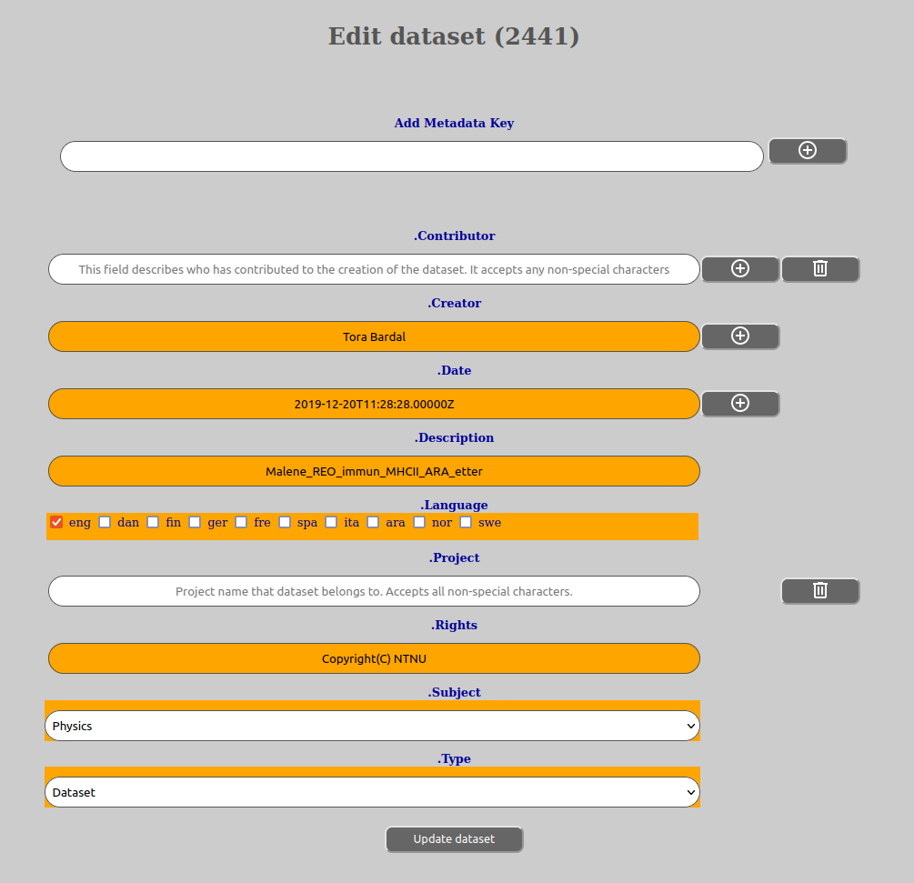

Please note that mandatory keys (must be filled in) are shown with an orange coloring o f the field.

All keys that can be added to or removed will have a add-symbol (circle with a plus) or a delete-symbol (trash can) behind them. This is to remove the key completely or to add or remove extra values on a given key.

It is also important to remember that when you choose to edit metadata, the metadata keys and their values that you see are not only the ones you saved, but also the ones that comes from any template(s) in effect. If you want to see which of the metadata are actually saved, you need to choose to just read what metadata has been saved (see [How to read metadata](#how-to-read-metadata)). Then no templates in effect will be added.

Editing metadata will be possible as long as the data of the dataset exists and the dataset has not been removed. When the dataset has been removed, the metadata will no longer be allowed to change.

You can also add new keys to the metadata that are not defined by the template(s) in effect. You can do that by:

1. Writing a new metadata namespace location in the input box labeled "Add metadata key" and click the add-button (symbol of a circle with a plus sign).
or
2. You can select a preset from the same input box by left-clicking once to get focus on the input box (and then for some browsers left-clicking once more) to get a dropdown menu of dataset presets.

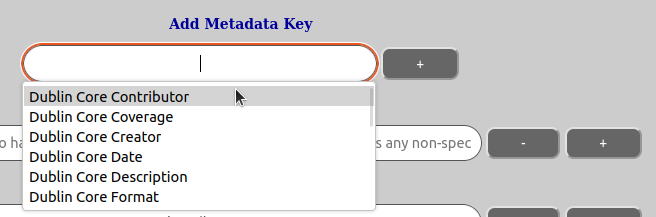

Allowable characters in a metadata key name is: a-z, A-Z, 0-9, "." (period) and "-" (hyphen). Please be careful with adding metadata keys outside of template, as it is desirable that users add data on the same metadata keys to ensure sensible searchability. We suggest that if you have long-term needs for certain metadata you should notify your lab administrator about this so he can ask the system operator for this to added in template, ensuring correct metadata namespace allocation as well as use. 

This said, you can customize your own metadata keys by manually adding them. Also remember that for normal metadata namespace, 
all keys have to start with ".", so eg. ".ThisAndThat", ".MyKey" and so on and so forth. The reason for this is that everything before "." is system metadata and not accessible for users in a normal way and should usually not be addressed. You will be allowed to add system metadata keys in the metadata editing window, but they will be ignored and removed when updating the dataset through the AURORA REST-server.

For more in-depth information on how metadata and metadata keys work, please consult the chapter called [How to edit template](#how-to-edit-template).

### How to edit dataset permissions

In order to edit dataset permissions do the following:

1. Go to the row in question in the "Manage"-view that have the dataset you want to edit permissions on.
2. Go to the column called "Modify" and in the drop-down menu select "Permissions..".

The rest of how to edit the permissions themselves is performed in the same manner as for other entities and this can be found 
in the following chapter [How to edit permissions](#how-to-edit-permissions)

### How to read metadata

In order to read the metadata of the dataset (read-only), do the following:

1. Go to the row of the dataset in question and then hit the three horizontal lines in the column called "View" and select "Metadata". A new window appear.

All the metadata will be protected and the user unable to change its values.

### How to remove a dataset

This option requires that the user has the DATASET_DELETE-permission on the dataset in question.

Performing this operation will not immediately remove the dataset, but instead start a voting notification-process where the users have to vote if it is ok to close the dataset. If no voting happens and the notification-process escalates up to the top of the entity tree the maintenance-service will cancel the removal process if the expire-date has not yet been reached.

Please note that even if it the dataset is removed, it is not actually deleted, but moved away from the user and kept for a certain time before being actually deleted.

In order to remove a dataset, do the following:

1. Go to the "Manage"-tab and find the row with the dataset in question.
2. Go to the Modify-column and left-click the three horizontal lines and select "Remove..".
3. In the remove dataset view, review the information and click the "Remove"-button if you agree to start the removal process.

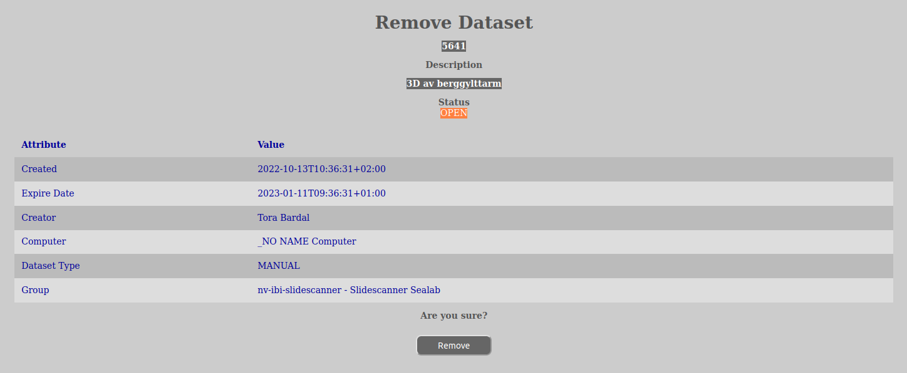

### How to quick-search

If you want to avoid learning the nitty-gritty details of regular searching, you can perform a much easier quick search that covers all the basic fields that you see when the datasets are displayed in the list of the Manage-view (Dataset ID, Group, Created, Creator, Description and Expire).

In order to this, do the following:

1. Click on the input dialog that is above the search- and clear-buttons.

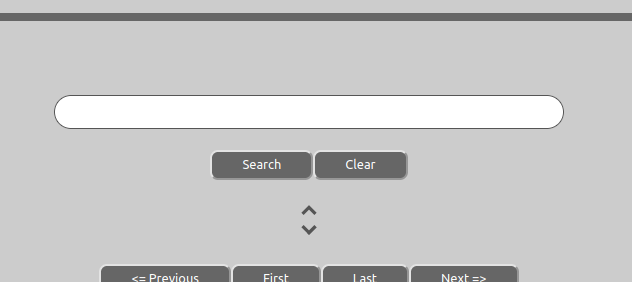

2. In the input dialog write the string you want to search for.

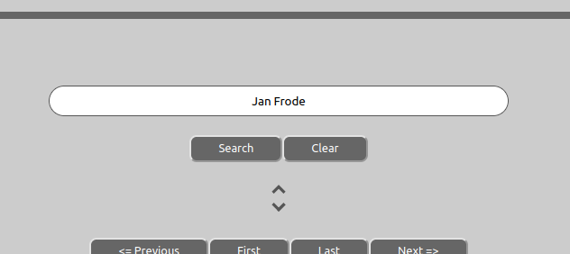

3. Press "ENTER" or click the "Search"-button to execute the search.

To reset the search click the "Clear"-button and then pressing the Search-button to execute it.

Also remember that the current executed search (by pressing search) is saved in the cookies of your web browser and will also be available the next time you go into AURORA.

### How to do advanced search

The manage-tab view has a rich ability to search for datasets based on metadata values. In order to open the search dialog with options for searching, click the expand-symbol below the search-button.

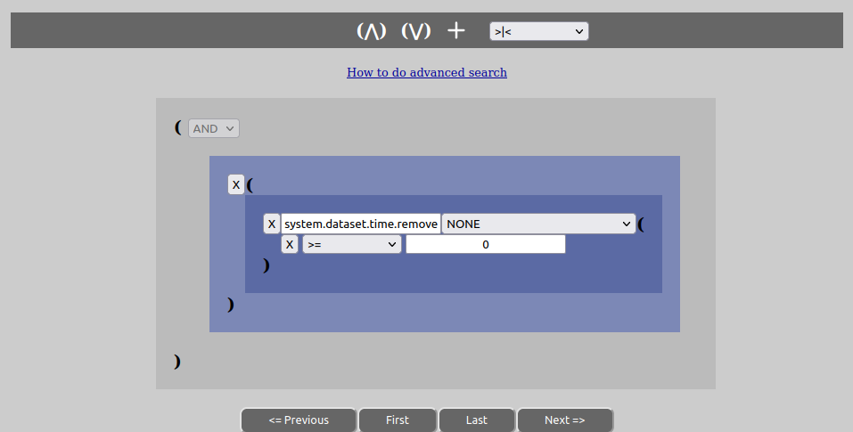

Then several choices will be available to you:

- Results per page (results/page).
- Add logical operators "AND" and "OR" betwwen groups of statements.
- Add search key presets
- Add user-defined search key
- Include removed datasets
- Sort by (which result field to sort the search by). This can also be controlled directly by click the various fields to toggle the field and ascending/descending (see sort direction below).
- Sort direction (result is either put ascending or descending)

"Results per page" is the number of datasets to show per page in your search result. You can change this by entering a new number or using the buttons on the input dialog to go up or down. In order for a new value to be used, you have to press the Search-button afterwards-

Now, in order to search one has to add statements to the structure that are shown on the screen. It consists mainly of "OR"- and "AND"-statements.

The advanced options toolbar for editing the search structure, basically has 4 tools:

- Add OR-group (**⋁**). Technically it can be set to be either OR, NOT and AND.
- Add AND-group (**⋀**)
- Add Key->Value (**+**)
- Add AND-group comparison operators (dropdown with comparison operators).

To add these various components to the structure, left-click once on the area you want to add it to and then press the toolbar symbol of choice. When it comes to key-names, they can be written or chosen through an input field and even easily changed later. The OR-groups comes in shades of gray coloring, while the AND-groups comes in shades og blue coloring in the web-client.

Please also note that it will always exist an "OR"-group set to be "AND" that contains the operator for ensuring the presence of either "including" or "excluding" the removed datasets or not in the search result. This can be chosen from the dropdown-menu on the toolbar.

The difference between an AND-group and an OR-group lies mainly in the fact that a pure AND-group cannot be changed to anything else and that it contains a set of key->value conditions that must all be true for the AND-group to be true. In addition an OR-group can never contain key->value pairs. As noted above an AND-group will be colored in shades of blue, while OR-groups will be colored in shades of gray, making it easy to pick out which is which.

So, lets say you want to search for all datasets that are owned by a particular research group called "XYZ". The key one is then looking for is the key called "system.entity.parentname". In  order to create such a search structure, do as follows:

1. Click on the gray-background of the existing OR-group (which is set to "AND").

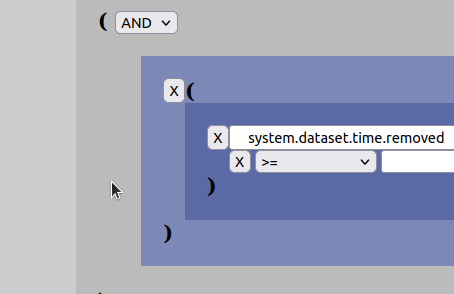

2. Click the AND-group symbol on the toolbar (**⋀**)

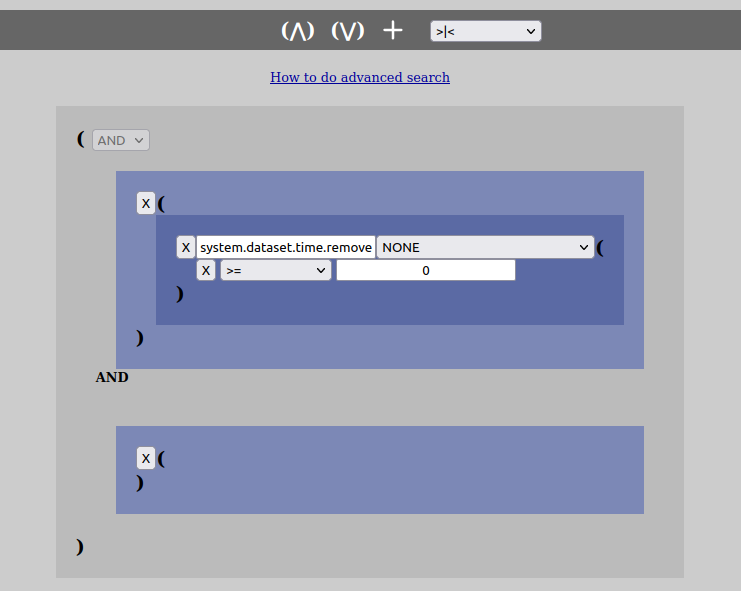

3. Click the blue-background of the newly created AND-group and then click the "+"-symbol to create a key->value pair and in the dropdown select the "system.entity.parentname"-key and click the "Add"-button on the right. The default comparison operator is equal "=", so no need to change this.

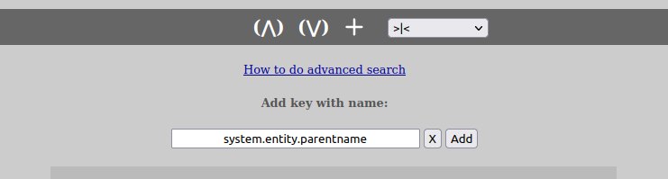

4. Write ""XYZ", the group-name we are searching for, in the input-box of the key and then click the "Search"-button to execute the search.

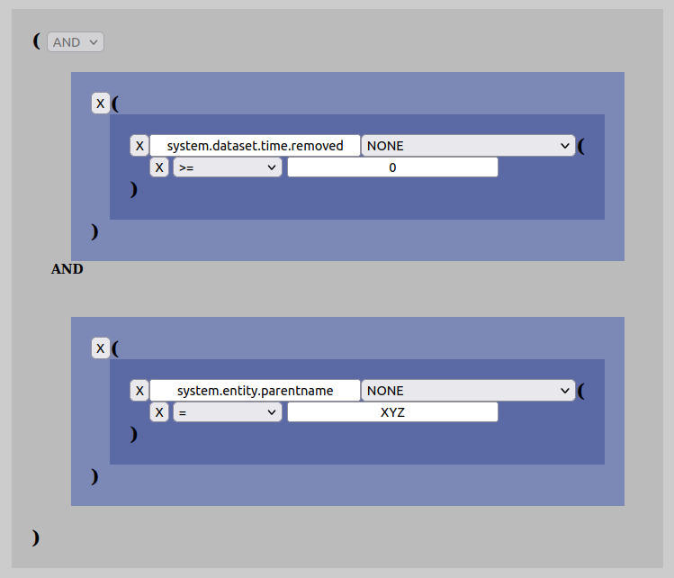

Please also note that the input-box supports values with wildcards ("**\***") and by using this one can write partial values for what one is searching for. Eg. instead of writing just "XYZ", one could write "**XYZ\***" and search for everything that starts with "XYZ".

Now that one have already added an AND-group it is easy to add more search criteria. Lets say that in addition to searching for the group "XYZ", we also want the search to match all datasets that has "John Doe" as the creator (Dublin Core ".Creator"-key):

1. Click the lightblue background of the AND-group to select it.

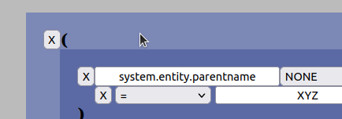

2. Click on the "+"-symbol on the toolbar in order to add a key-value pair to the AND-group. Select the Dublin Core creator-field from the dropdown-menu or just write ".Creator". Click "Add" to add it to the AND-group.

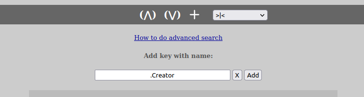

3. After its been added, click on the input-box of the ".Creator"-field and write "John Doe".

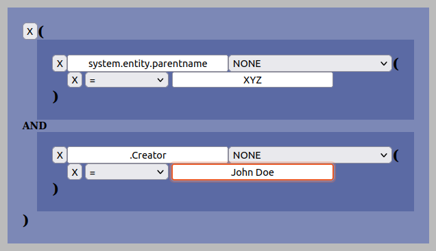

4. Click the "Search"-button to execute your new search.

Please also note that all searches done in the "Manage"-view will only return results based upon the permissions of the user doing it, no matter the logical structure of the search.

As one can see from previous examples, all the added keys contains a separate dropdown to the right of the key name:

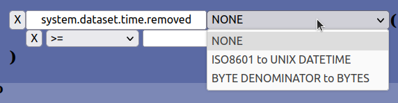

This dropdown is the filter. The filter is used to convert a value specified for a key according to some conversion scheme. The ones that are possible to select at the moment is: NONE, ISO8601 to UNIX DATETIME and BYTE DENOMITATOR to BYTES. NONE is the default and means that no filtering is done on the value specified for the key in question. In most cases this selection will suffice.

However, certain values in the dataset metadata are special values that are not practical to specify manually and where a suitable abstraction will help (such as converting textual ISO-time to unix datetime used inside the database for several metadata values).

Here is an example of how to convert between ISO8601-time and Unix Datetime by using a filter during search:

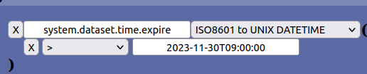

The value for the key above will be converted from ISO8601-time to unix datetime before giving its value to the AURORA system during searches. The filter also support specifying time without hours, minutes and seconds and even without using the T-separator between date and time. Valid examples:

 - 2023-11-30T08:00:00
 - 2023-11-30 08:00:00
 - 2023-11-30 08:00
 - 2023-11-30

and so on and so forth.

The BYTE DENOMITAOR-filter can convert between byte denominators and the same value in Bytes. This is practical when eg. using the dataset-size key which is stored as a Byte value:

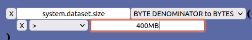

Valid Byte-denominators are:

  - K or KB (Kilobytes)
  - M or MB (Megabytes)
  - G or GB (Gigabytes)
  - T or TB (Terabytes)
  - E or EB (Exabytes)
  
As one can see, both single and double letter denomitaors are accepted. It also accepts the denominators in both lower- and uppercase.

### How to vote on notifications

Certain notifications or actions in AURORA will prompt a voting process by the Notification-service. As of writing this happens when a dataset has expired for closing or for removal. It will also happen if a user asks for the dataset to be removed.

A voting process is a mechanism whereby the users vote for a certain action to take place, in this case removal or closing of a dataset. When users receive a notice about such a voting process, the notice (eg. an email) will contain voting information as well as a link to cast your vote(s). If enough votes are cast by various users the notified action will be executed.

The reasoning for this process is that we do not want certain actions to happen in AURORA without proper approval, especially not removal. Using a voting system also allows for a certain flexibility in how a research group specifies what votes their users have. The number of votes required to perform one of the actions are globally defined by the AURORA system. The only thing the research group can do is to specify the vote distribution among their users (some might not have any votes at all).

If no voting is performed in the event of a voting process, the notification will in time be escalated to the next level in the AURORA entity tree and whoever has votes on this level can also vote or take action to stop the process. Escalation will continue until the issue is resolved or it reaches the top of the entity tree, whereby the following will happen:

 - If a close-dataset notification, the dataset will automatically be closed if the expire date has not been changed in the mean time.
 - If a remove-dataset notification, the dataset will automatically be removed if the expire date has passed. If the expire date has not passed the dataset will not be removed and since reaching the top of the entity tree renders the notification unable to perform the action it is basically a lame duck and the notification and voting process will be cancelled.

As mentioned earlier the voting process involves escalations up the AURORA entity tree if no one votes or takes actions to stop the notification. The escalation process works as follows:

 1. A notification is created on the level of the entity that the notification is about (most typically a dataset).
 1. The Notification-service checks for what users or votes exists on the level that it is at in the entity tree. If the level happens to be a dataset, only the creating user of that dataset is sent a notice about the voting process. The creating user is automatically given 1 vote, which is not enough to remove a dataset.
 1. If nothing is done to vote within a grace period, not enough votes have been achieved or any action has been taken to cancel the voting-process (such as extending the expire-date of a dataset), the notification is escalated to the next level in the tree.
 1. The voting-process then repeats from point 2 above and down to 4, except this time the creating user does not getting any more votes. The automatic vote is only on the level of the dataset itself when the process starts. Being given votes on higher levels requires that votes have been defined for a specific user on that part of the tree.
 1. When enough votes have been cast, it executes the action in question (such as dataset removal) or if it reaches the top of the entity tree without enough votes, it depends on what notification it is (see above).

When a notice is sent to user(s) it will in the case of a voting-process contain a message that includes the voting/acknowledgement information:

	This message requires voting in order for it to be accepted. We need you to vote on it by clicking on the link below (you are not to enter any information on this page):
	
	https://www.aurora.it.ntnu.no/?route=ack%3Fid%3DlaKu8fSakFPkPLhK5saVLI9bYuGXtHgv%26rid%3DoRGR9uMKwAi5zGd0QOGBxtsveXyAjx1D

When you choose to vote to execute whatever this message is about, you will be sent to the confirmation page of AURORA. There you will be asked to login if you are not already logged in and then you will be asked if you wish to acknowledge the notification or not?

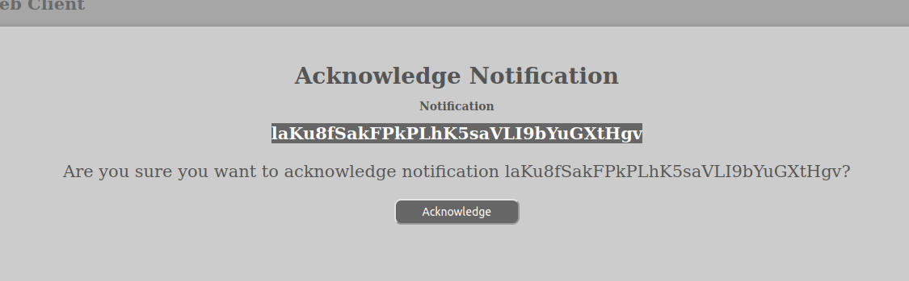

When you confirm the web-client should return with a message saying that it was successful or not. Usually, we hope, successful:

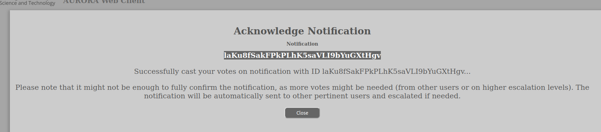

We would like to underline that the AURORA voting process is completely performed by digital ballots and we do not foresee creating support for any physical notices whereby a mail-man will knock on your door and ask for physical ballotting. Reaching the required votes in a voting process is completely by popular vote. No voting-processes are rigged, faked or otherwise stolen. Except, we guess, that the research group administrator might be construed as having a heavy leaning towards giving certain members more votes than others or when AURORA keep the current dataset because of lame duck events and no or enough voting has taken place. This we call enlightened rule.

### How to view the dataset log

This option requires that the user has the DATASET_LOG_READ-permission on the dataset in question.

There are many reasons to want to read the dataset log, but some of the most common will be to check on the progress of the Store-service. This is especially the case during the acquire-phase of Automated sets.

In order to view the dataset log, do the following on the "Manage"-tab:

1. Go to the row of the dataset in question and then hit the three horizontal lines in the column called "View" and select "Log". A new window will appear with log details relevant for the given dataset in question.
2. View and check whatever you want to in the log and change the loglevel if you want to more information from the AURORA-system, like selecting the "DEBUG" loglevel. Please also note that to update log-information that is being received you can opt to regularly hit the "Refresh"-button. Also note that selecting to show the tag will tell you which part of AURORA and in some cases process type that generated the log message line in question.
3. When finished reading the dataset log, close the window or hit "Return to datasets" or any other relevant option.

The loglevels go from DEBUG all the way up to FATAL, where DEBUG gives you the most detailed number of logged entries, while FATAL will give you the least (if any). As default the log view is set to INFORMATION-level log entries.

## How to access data

### File-interface

The primary way to access the data of AURORA datasets is the socalled file interface.

#### Mounting (in windows)

- SMB mount the interface by right-clicking "My computer" and select "Map network drive..."
    
    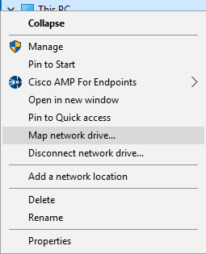
- Type in path "\\\\fagit.it.ntnu.no\\aurora" and select drive letter
     
    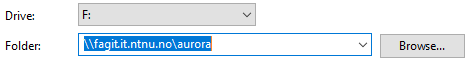
- Authenticate if asked

#### Access on linux

The Aurora fileinterface is available on login.ansatt.ntnu.no at /fagit/Aurora/view/access/user/<username>.

You may mount the fileinterface on your local computer similar to the description in [Mounting (in windows)](#mounting-in-windows).

#### Folder structure

In the top folder of the connected drive you will find

- datasets - all the datasets you have access to by creation date, name and ID. (2)
- ALL - a folder containing all datasets you have access to by dataset ID.
- selection folders - folders containing personalized selection sets. (2)
- *.html - web shortcuts into the Aurora web interface. (1)
    
    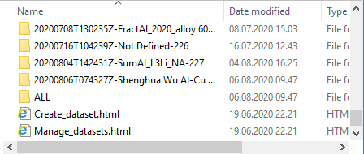

Use the Create_dataset.html to create new datasets.

#### Structure of a dataset

A dataset folder will contain

- data - a folder where the actual data of the set resides
- *.html - web shortcuts for this dataset.(1).
- additional files and folders not described here.

    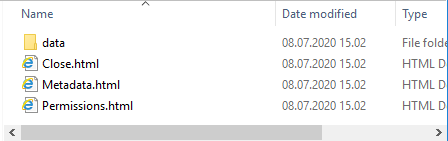

The "data" folder is where the actual data resides. You may change the the content of this folder in the usual ways for open datasets. Open datasets is dataset created as "synchronous" and not yet closed.

#### Footnotes

(1) The .html extension may be hidden by your operating system, but the .html files could still be recognized by a web browser icon.

(2) The selection set mechanism is not yet implemented. When implemented you should be able to tailor the selection folders as well as the top folder.

### Web-client interfaces

There are several ways of accessing the data of a dataset. AURORA defines a concept called “Interface” that gives you various ways to access your data. 

To see which interfaces that are available for your dataset:

1. Go to the “Manage”-tab and the find the dataset in question.
2. Go to the “Retrieve”-column of the dataset and select the interface that you would like to use. 
Examples of available interfaces are: zip-archives, tar-archives and samba/cifs-shares.

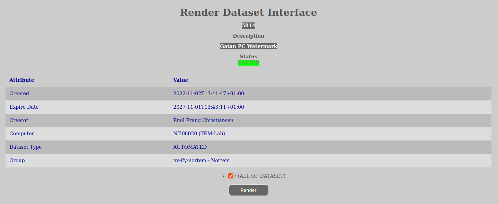

3. After you have selected the folders you want, hit the button “Render” and the interface will be rendered.

Sometimes the rendering might take some time, especially in cases like with zip- and tar-sets. It is advisable to keep the render-tab open in the browser and refresh it once in a while until it is has a ready rendering. The reason for this is that the information that you get back is closely tied to which folders you select to render and are dependent upon you selecting the same folders in order to see the rendered interface if you go back later.

When an interface is finished being rendered information about how to get the data will be displayed on the screen.

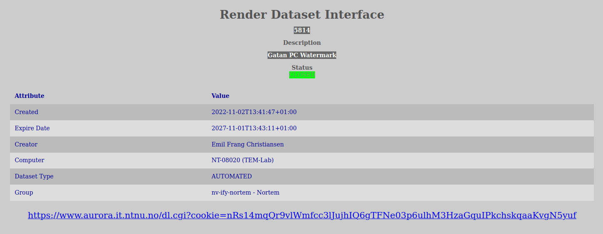

Please also note that all of your datasets will always be accesible through various standardized protocols such as Samba/CIFS (please see the [File-Interface chapter](#file-interface) of this document).

Some interfaces will not be available to users outside of NTNU. An example of this are the samba-shares that require an NTNU-account/username for authentication.

## Remote control a computer

AURORA includes functionality to open up a tunnel from a user-computer, to a lab-computer. This for controlling experiments in the lab from a remote locations. The remote control protocols supported, can be defined flexibly in the AURORA templates, for any given computer. Common protcols are, RDP and VNC.

This functionality relies on a gatekeeper-service located on another server and that are utilized by AURORA.

To use this capability you need to have the COMPUTER_REMOTE-permission on the computer. If you do not have that permission, please go cuddle your laboratory administrator for permission.

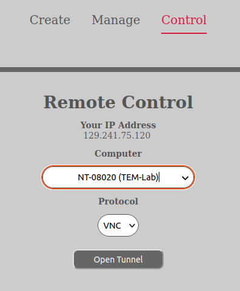

If you wish to open a tunnel for a computer you have, you can do the following:

1. Go to "Control"-tab.
2. In the remote control window select the lab computer you wish to remote control.
3. Next, select the protocol that you wish to open to the lab computer.
4. Press the "Open Tunnel"-button.

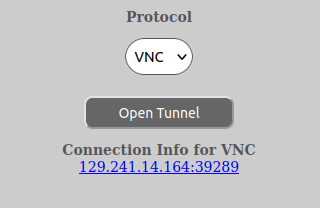

A new window will appear with the information to utilize the new tunnel. Please note that you have to start using the tunnel within 10 minutes or it will close. After you have started to use it, it will stay open until you close your remote control software or the software looses its connection. At that point, one would need to open a new remote control tunnel to continue working.

The remote control tunnel is only valid for the computer you opened the tunnel from, as stated in the "Your IP address" field in the image above.

In addition, for RDP and VNC connections one can click the link for the new tunnel and download a auto-generated shortcut file for either RDP or VNC.

## Manage the entity tree

AURORA has the ability to define and mange an entity tree of the various parts of the system such as USER (for users of the system), GROUP (organizational/logical and roles), TEMPLATE (for defaults and enforcement of settings in the entity tree), STORE (for various ways of transporting data), COMPUTER (for devices that generates data) and INTERFACE (for ways of accessing the data in the datasets).

The AURORA Web-client has a entity tree view where all of these entities can be managed. They can be created, moved, deleted, assigned permissions, edited metadata and so on dependant upon your assigned permissions, the restrictions inherit in the entity type and any possible templates.

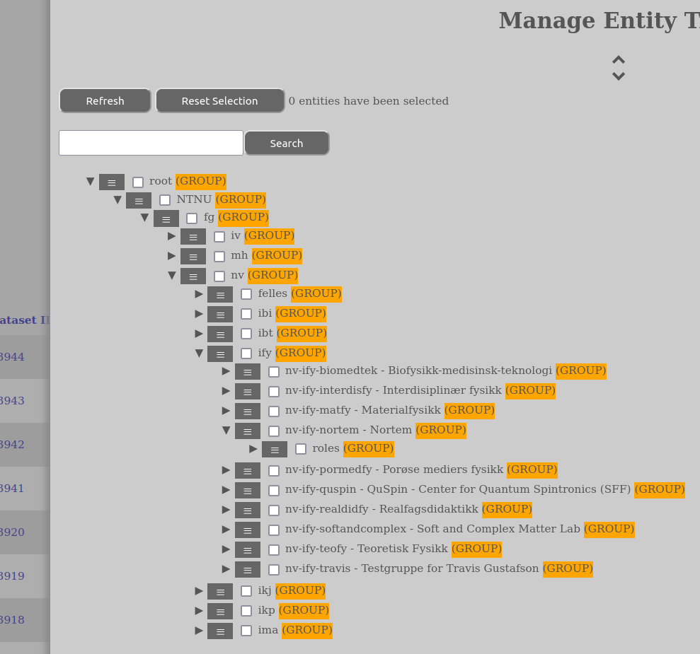

### Introduction to concepts

These are some introductory concepts about how to work with the AURORA entity tree. It is especially relevant to those that have management roles in Aurora. 

It should also be noted that the research group-, roles- and lab- setup described here in the entity tree is only a best practice recommendation that we are using at NTNU. AURORA itself it totally general and dynamic and one can easily create other structures and setup. But it is easy to get lost in the vast abyss of groups and permissions if one doesn't know what one is doing. It is also a point to avoid too much granulation, which again increases complexity and potential confusion.

#### Structure overview

The basic element in Aurora is a called an entity. It has a type, a parent and a set of metadata.

##### Entity types

There exists several entity types in AURORA, but those that are most relevant to user- and management roles 
are:

- **Dataset** - the main object that holds the data
- **Computer** - the source of datasets
- **User** - the actors
- **Group** - structural entity for organizing the tree and roles

AURORA might also be confusing in the sense that it doesn't differentiate between Group-entities that are pure organizational/structural entities in the tree and those that are socalled role-groups. To AURORA all of them are just groups and it is how you use them in the tree that makes the difference. This flexibility is also why we recommend as best practice to make the setup as easy as possible.

Entities are tied together with three different relations:

##### Relations

- **Parenthood** - being a parent for other entities (the basic tree structure created by the parent attribute).
- **Membership** - associates an entity with groups
- **Permission** - grant a set of permissions for one entity to do certain operations on another

The parenthood forms a single noncyclic tree, but as a special case the root node is its own parent. Only groups can be parents, other entity types will be leaf nodes.

##### Membership

Membership associates an entity to another. It is directed, so assigning A as member of B does not make B member of A, but B may also be assigned to A explisitely. A child is considered a implist member of it self and its parent.

##### Roles

An entity has a set of roles. The roles is the cascading set of its memberships. Consequently A's roles include A, all its ancestors, B and its ancestors, and all other memberships the any of them may have etc. Consquently all entities is member of the root.

Caveat: Assigning root as a member of another group will give the group role and any derived role to all entities. Care should be taken when assigning any higher level group as a member.  

##### Permissions

A set of permissions may be granted for an entity (subject) on another entity (object). Permissions will also be inherited from the objects parents, unless explisitly denied.

The complete set of a subjects permissions on a object is the union of direct or inherited permissions for all of the subjects roles.

#### Management tasks

The Aurora "basic goal" is to move datasets from a lab computer to a research group where it can be made available for the group members or others who need access to it. The management tasks is thus mainly to give the users the neccesery permissions for the operation.

The primary interface for management is the entity tree view. This is found by logging into the Aurora web page and select "Manage entity tree" from the dropdown menu in the top-right corner. The tasks is based on how NTNU currently has organized the structure, and may change if we manage to integrate Aurora with other systems and services, such as BookItLab (but, then this documentation will also change).

The tree references is given like "/NTNU/[ORGFAC]/[ORGDEP]/Labs/TEM-Lab" where the "/" separates the different nodes. The leading "/" is short for ROOT/. The elements inside "[]" is placeholders for the relevant entity, such as Faculty, Department, NTNU etc.

Left of the entity name there is a menu icon consisting of three lines. By clicking this you can select what to do with this entity. 

###### Some definitions

- **User** - A person using Aurora
- **Role** - A group of users and/or groups with similar role 
- **Research group** - A group of collaborating users
- **Computer** - A computer generating datasets, normally for an instrument
- **Lab** - A collection of computers administered together

###### Users

Users are automatically created when they log into Aurora with FEIDE. This is the recommended way of creating users. They may however be created manually as a local user. Local users will then be matched with a FEIDE login if the email address matches.

Users is located in /_ORG_/users/_email_ like "/NTNU/users/bard.tesaker@ntnu.no". To create a local user select "Create User..." on /_ORG_/user/.

###### Roles

Roles are generally located in:

	[ORG]/[ORGFAC]/[ORGDEP]/Labs/[ORGLAB]/roles
	[ORG]/[ORGFAC]/[ORGDEP]/Research Groups/[GROUP]/roles

depending on whether the role is in relation to the computers of a lab or a research group.

- To create a role, select "Create Group..." on the roles-folder in either the lab-group og research-group in question. See the [How to Create an Entity](#how-to-create-an-entity)-paragraph for more information on creating an entity/group.
- To assign members to it, select "Members..." on the group in question. See the [How to add members on a group](#how-to-add-members-on-a-group)-paragraph for more information.

##### Create a research group

For most purposes, research groups are created in the BAS group admin (https://bas.ntnu.no/groupadmin/) as fg_-groups and then automatically synced into AURORA. This is the case for all NTNU groups and users. However, sometimes external groups have to be created manually.

###### Create the group

Create the group under:

	 [ORG]/[ORGFAC]/[ORGDEP]/Research Groups/

Name it "[ORG]-[ORGFAC]-[ORGDEP] [group-name]" so it is uniquely identifiable in dropdowns etc.

###### Create roles for the group

We suggest three roles for the research group

- NO ENDING (just the group name) - for ordinary group members
- **admin** - for group administrators
- **gjest** - for guests with only create permissions on the research group (cannot see the other datasets in the research group besides ones own)

Under:

	[ORG]/[ORGFAC]/[ORGDEP]/Research Groups/[GROUP]/roles

create the three roles like "[ORG]-[ORGFAC]-[ORGDEP] [group-name]_[roles]", such as:

	NTNU-NV-IBI Evolutionary Genetics and Fruitflies
	NTNU-NV-IBI Evolutionary Genetics and Fruitflies_admin
	NTNU-NV-IBI Evolutionary Genetics and Fruitflies_gjest

Then:

- Add members (users or roles) to the role. See the [How to add members on a group](#how-to-add-members-on-a-group)-paragraph.
- Assign GROUP_MEMBER_ADD permission on the role to the adm-role (including on itself). See the [How to Edit Permissions](#how-to-edit-permissions)-
paragraph.

###### Assign permissions to the roles

On the:

	[ORG]/[ORGFAC]/[ORGDEP]/Research Groups/[GROUP]/roles

and its roles, select "Permissions...". Grant the following permissions to the roles:

- NO ENDING (just the group name): DATASET_CREATE, DATASET_CLOSE, DATASET_LIST, DATASET_LOG_READ, DATASET_METADATA_READ, DATASET_READ
- admin: DATASET_CHANGE, DATASET_CREATE, DATASET_CLOSE, DATASET_DELETE, DATASET_LIST, DATASET_LOG_READ, DATASET_METADATA_READ, DATASET_MOVE, DATASET_PERM_SET, DATASET_PUBLISH, DATASET_READ, DATASET_RERUN
- gjest: DATASET_CREATE (all DATASET-permissions are implicit on a dataset for its creator, except DATASET_MOVE and DATASET_DELETE)

##### Add new lab

The lab is essentially a collection of computers. This is where the permission to read from the computers is granted

- Create the lab with a descriptive name by using "Create Group..." under:

	[ORG]/[ORGFAC]/[ORGDEP]/Labs/

- Create a role as "[ORG]/[ORGFAC]/[ORGDEP]/Labs/[ORGLAB]/roles/[LABNAME]_user", such as:

	NTNU-NV-IBI Ethology Lab_user

- grant COMPUTER_READ to the role on the lab in question, in the case above:

	NTNU/NV/IBI/Labs/NTNU-NV-IBI Ethology Lab

##### Add a computer

- Select "Create Computer..." on the:

	[ORG]/[ORGFAC]/[ORGDEP]/Labs/[LABNAME]/

- Fill in whatever metadata comes up, but particularly:

    - .computer.path

        Local path to the data folder, for Windows-computers in "cygwin" notation, like "/cygdrive/c/data" for "C:\data"
        
    - .system.entity name

        The computer name. We recommend a unique name, NTNUnnnnn if available.

    - .system.task.param.host
        
        The domain name for the host, like "ntnunnnn.dyndns.nt.ntnu.no"

    - .system.task.param.knownhosts

        _Do so and copy result.... (TODO) - wrap a cgi (on app) around "ssh-keyscan host"_ 
        
    Press "Create Computer"

### How to add members on a group

On all groups (both roles related and hierarchical/organizational ones) one can add members. These members will inherit any permissions or memberships that this group has. This makes it easy to manage which users get what permissions. 

For most purposes, one should administrate group-members through BAS group-admin for all NTNU-users (https://bas.ntnu.no/groupadmin/). This will then be synced into AURORA within half an hours time. Please also remember that only users that have logged into AURORA once, will be synced in place for their group memberships. This is because it is impossible for AURORA to sync and populate group memberships without having an actual account in AURORA to refer to. But, please add relevant users to the relevant fg-group in BAS and then tell the user to log into AUORRA using FEIDE.

Groups that are not NTNU-groups will have to be administrated through the AURORA web-client interface. This also goes for users that are added as members of non-NTNU-groups.

Now, it is important to remember that the research- and/or subject area groups (in AURORA just called research groups) are the ones that owns the datasets. This means that one has to manage how those datasets are being accessed and used by the users. This is done through groups that are set up as roles related groups (they are still just of the entity type GROUP). These can be accessed under root/NTNU/[FACULTY]/[DEPARTMENT]/Research Groups/[GROUPNAME]/roles, where "FACULTY" is the faculty acronym (eg. NV), "DEPARTMENT" is the department acronym (eg. IFY) and "GROUPNAME" is the name of the research group in question. So a full example would be:

	/root/NTNU/NV/IFY/Research Groups/NTNU-NV-IFY Nortem/roles

When a user creates a dataset he has to choose where to save the dataset. This choice is a group which then will own the dataset. The user will by creating the dataset get all permissions on that specific dataset (except DATASET_MOVE, DATASET_DELETE and DATASET_EXTEND_UNLIMITED), but not necessarily to the other ones that resides with the group (he might not even see them).

The research group itself resides under the department or section in question under a sub-category called "Research Groups". In AURORA the departments will be found under root/NTNU/FACULTY, where FACULTY is the acronym for the faculty, such as NV (Faculty of Natural Sciences). Under the specific research group in question the datasets will reside:

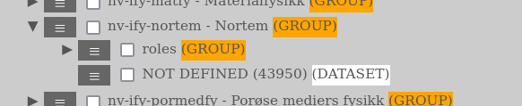

In AURORA we have divided all research groups into three roles (or role groups):

- GROUPNAME (used for members of the research group. Get all the reading and listing permissions of all the datasets in the group, but no change, removal etc.)
- GROUPNAME_admin (administrative for the research group. All permissions on the datasets under it)
- GROUPNAME_gjest (used for guests that only get the permission to create datasets)

The _admin-group is for the administrators of the research group and have all the relevant permissions on the groups datasets (including updating, deleting etc.). The _gjest-group is for guests and only have the permission to create datasets on the group (cannot see the other ones, delete, read and so on - only his own datasets). The group that is just the group-name is for users that are members of that research group and they will have access to all the datasets created there, read them and their metadata, but will not have any change or deletion privileges except for those they have created themselves.

The role groups resides under the research group itself in a GROUP called "roles".

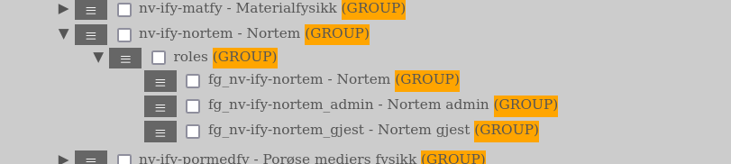

When you find a role group which you have administrative permissions on (by residing in one of the _admin-role groups), you can add or remove members by left-clicking the symbol with the 3 horizontal lines and in the dropdown menu select "Members...". The AURORA web-client will then open a separate tab or window with the "Member..."-window:

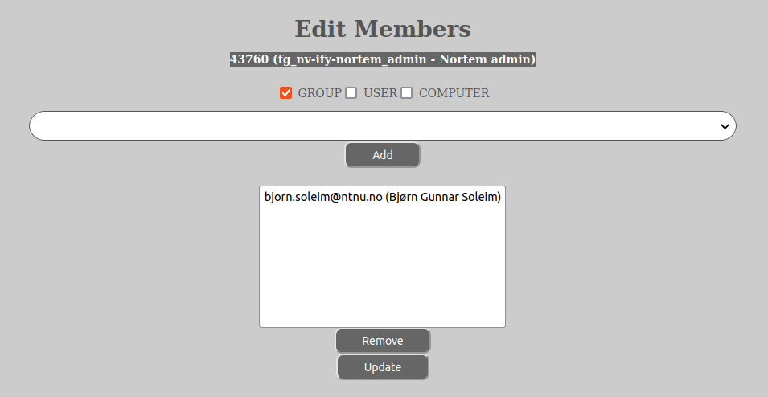

As the astute individual is able to find out upon seeing the "Members..."-window is that you can add both GROUP- and USER-entities. Please refrain from adding GROUP-entities if you do not know what you are doing. As best practice we recommend to only add USER-entities to the role groups.

The entities that are already members will be shown on top in the select-dialog in the "Members..." and separated from the tree by a long horizontal line. You can now add or remove members of the role group in question by selecting the user-entity in the select-dialog and then clicking on either the "Add" or "Remove"-button.

### How to create an entity

This option is available for: GROUP, COMPUTER, USER and TASK.  It is also only available on an existing GROUP-entity wth the exception of TASK (which is also available on a USER-entity). The user must have the CREATE-permission (GROUP_CREATE, COMPUTER_CREATE etc.) on the parent-entity in question.

Please note that what metadata must be answered in order to create an entity depends on which templates are assigned to the entity tree and have effect on the parent-entity and the entity type that you are attempting to create.

When you select to create an entity from the drop-down menu on another entity, that entity will become the created entity's parent.

1. Go to "Manage Entity Tree" on the main menu of the AURORA web-client. Select one of the create options:

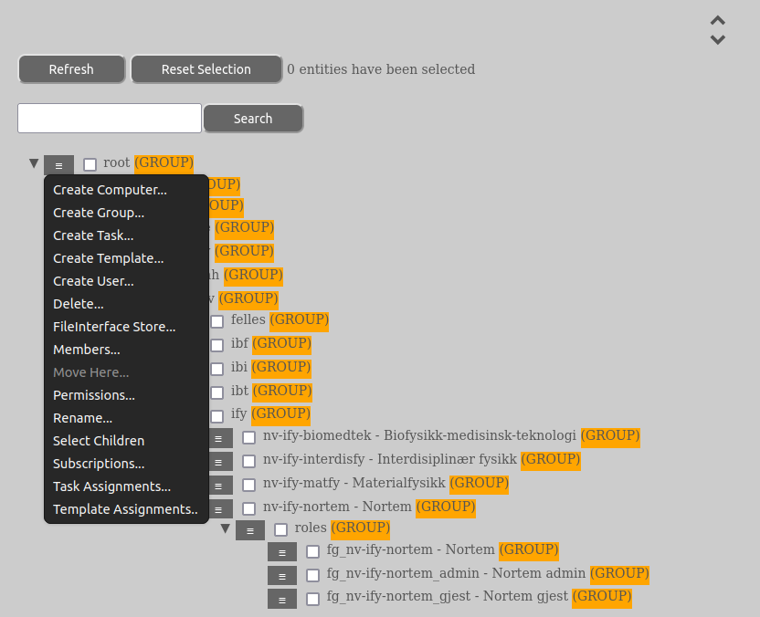

2. After you select one of the options and left-click your mouse on it and new screen appears and you might be asked about metadata that needs to be filled in (dependent upon the template(s) in effect). After any metadata is filled in and you hit "create [ENTITY-TYPE]", you should be provided with a success-message.

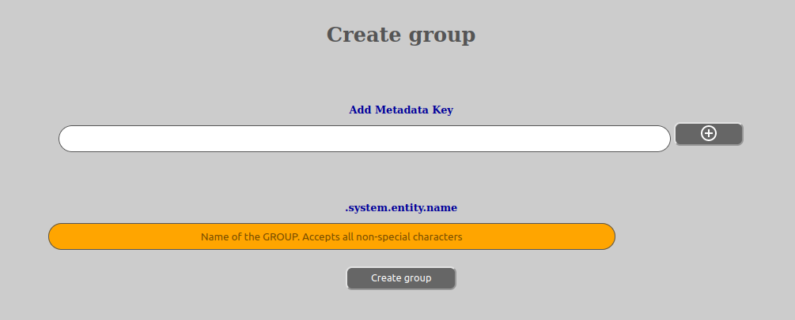

### How to delete an entity

This option is available for: GROUP, COMPUTER, USER, TEMPLATE and TASK. The user must have the _DELETE permission (GROUP_DELETE, COMPUTER_DELETE etc.) on the entity in question.

Please note that deleting a USER-entity is strictly not possible as it will only be anonymized (GDPR). Please see the AURORA web-client privacy statement for more information.

1. Click on the "Manage Entity Tree" on the top-right dropdown-menu.
2. Go to the entity you want to delete and right-click to open the dropdown-menu and select "Delete...".
3. You will be presented with a confirm screen. Click "Delete" if you wish to actually delete it.

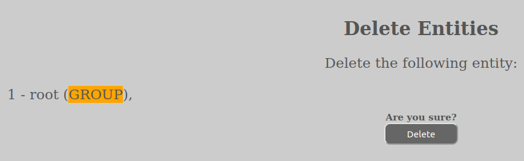

After you have confirmed the deletion, you should be presented with a success message.

Please note that you can also select several entities by ticking the checkboxes in front of entities in the tree. The delete functionality will then be able to delete your entire selection upon confirmation provided they do not have any children or other problems with doing it.

### How to edit metadata

This option is available for: COMPUTER and DATASET.

The possibility of editing metadata is available by selecting the "Metadata..."-option on the drop-down menu of the entity in question.

The web-client will then open a separate tab with the editing of the metadata. Which metadata appears in the window depends upon if any has been defined before and also any template(s) in effect will also influence the outcome.

When editing metadata for a dataset, you will see something like this (dependant upon templates in effect):

while editing computer metadata will be something like this:

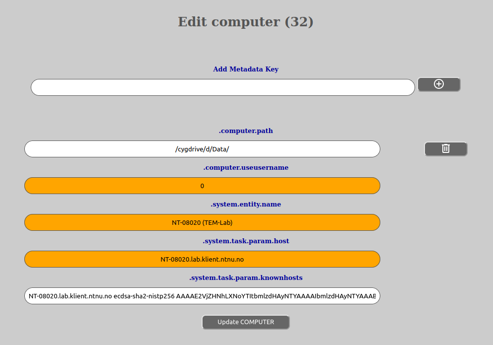

An asterix on the right hand side of the metadata-key value input means that the given metadata-key is MANDATORY (see [How to edit template](#how-to-edit-template)). This means that you have to fulfill whatever requirement is on the key from any aggregated template(s). There is also a minus-button on the right hand side of the input-fields which makes it possible to remove that given metadata key or values on that key (a metadata key can have multiple values if so defined). Please note that even if you remove a field here that is defined as MANDATORY, it will fail upon checking and the metadata-script will come back and notify you if need be.

You can also add new keys to the metadata that are not defined by the template(s) in effect. You can do that by:

1. Writing a new metadata namespace location in the input box labeled "Add metadata key" and click "Add"...
or
2. You can, if you are editing metadata for a dataset, select a preset from the same input box by left-clicking once to get focus on the input box (and for some browsers left-clicking once more) to get a dropdown menu of dataset presets.

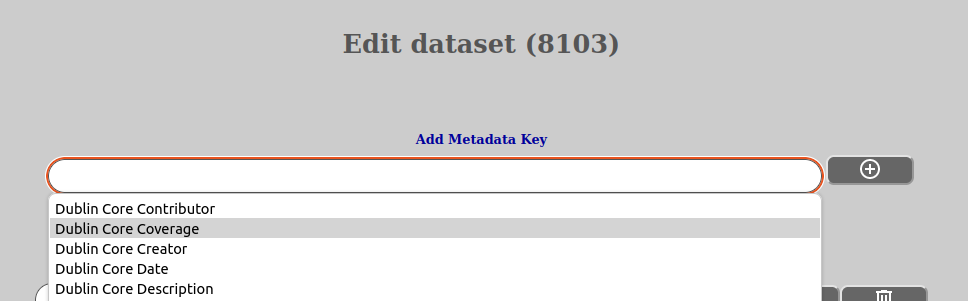

Allowable characters in a metadata key name is: a-z, A-Z, 0-9, "." (period) and "-" (hyphen). Please be careful with adding metadata keys outside of template, as it is desirable that users add data on the same metadata keys to ensure sensible searchability. We suggest that if you have long-term needs for certain metadata you should notify your lab administrator about this so he can ask the system operator for this to added in template, ensuring correct metadata namespace allocation as well as use. 

This said, you can customize your own metadata keys by doing this. Also remember that for normal metadata namespace, all keys have to start with ".", so eg. ".ThisAndThat", ".MyKey" and so on and so forth. The reason for this is that everything before "." is system metadata and not accessible for users in a normal way and should usually not be addressed.

When you have made the necessary adjustments, hit the "Submit"-button and your changes will be submitted. You should receive a message saying the metadata has been successfully updated.

Please note that all metadata handling happens in a separate script called metadata.cgi and that therefore you will experience some redirects between the page you are in and that page. Therefore allow for time to reload/redirect.

### How to edit permissions

As of this writing it is possible to edit permissions on GROUP, USER-, TEMPLATE-, TASK- and DATASET-entities. AURORA has a rich set of permissions that can be set or removed on any given entity. These permissions are also inherited down the entity tree, which makes it possible to set permissions higher up that have effect further down. The permission structure of AURORA is divided into 4 categories:

- Inherited (these are permissions that an entity has inherited from above in the tree).
- Deny (this is a permission that has been denied the entity. It is applied before the grant-category).
- Grant (this is a permission that has been given to an entity and will have effect below the entity in the tree as well).
- Effective (this is the resultant permission on an entity after one has applied the inherited, then the denied and last, but most important the grant-category).

In order to edit permission on an entity you go to the "Manage Entity Tree" and then locate the entity you want to edit, click the icon with the 3 horizontal lines to the left of its name and select "Permissions...". Then a separate window will open.

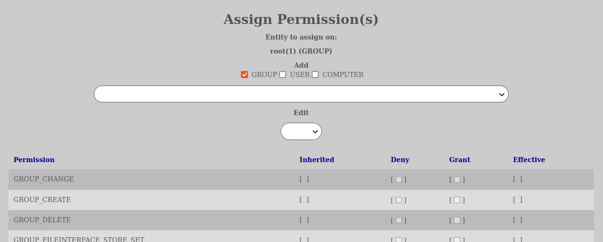

The permissions window will have two input fields, whereas the topmost is the selection of new entities to add permissions for on the chosen entity. This input field is searchable as most input fields of the same type in AURORA. It is also possible to narrow the search pool that one is using and by default only "GROUP"-entities are included. One can also tick off "USER" and "COMPUTER"-entities if those are to have permissions added.

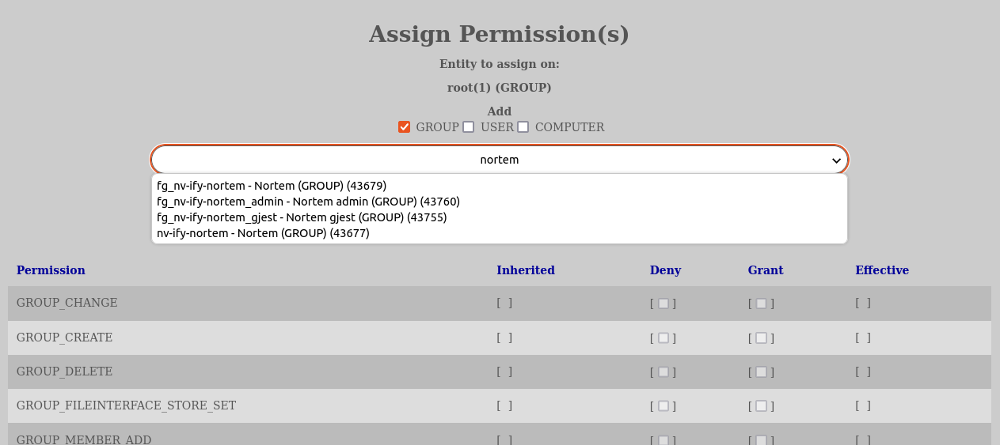

The second input field is the edit field where one chooses the entity that already has permissions set on the entity in question. Here one can select to modify/change/review those permissions.

For practical reasons we can say that for most users, they should only edit permissions on datasets or the role groups of the research groups that owns the datasets (to make it effective for all datasets of that group). All other editing should be reserved for administrators.

As best practice we recommend to set the general permissions through the role groups (NAME, NAME_admin and NAME_gjest see the ["How to add members on a group"-paragraph](#how-to-add-members-on-a-group). If it is desired to have more granulated settings, we recommend that these are set on the datasets in question themselves (not on the research group or its role groups). This granulation can even be managed by the users that created the datasets themselves.

If there are any permissions for an entity, they will be displayed in the 4 aforementioned categories of "inherited", "deny", "grant" and "effective" (see above). One can then click the various permissions' deny and grant checkboxes to change the permissions for that entity that you have selected and then click the button "Update" to make the changes active. When you press update, the web-client will try to update the new permissions and then show you the result after reload.

The inherited column will have a check mark in the middle of the []-clause if it has the permission in the respective row inherited from above in the tree. If nothing is inherited, there will be no checkmark there. If the entity that was chosen from the edit-field has either deny or grant-permissions set on the entity that one is viewing (in the example above the "ROOT"-GROUP or top of the tree), the checkmarks will be checked or not. In the effective-column a check mark will be shown if the permission on the respective row is in effect or not (either through inheritance or grant or both - yes you can actually set grant and then inherit at the same time).

### How to edit subscriptions

This options is only available for GROUP-entities. The user must have the GROUP_CHANGE-permission on the group in question.

The subscriptions view sets two properties on a group:

 - Which users and using which Notice-delivery (Email, SMS etc.) are to be notified when a Notification is generated on that given group in the entity tree?
 - What number of votes do the defined user(s) have when the Notification recides on that group-level in the entity tree?

An explanation of concepts is here required. All notifications sent by the Notification-service of AURORA must know which user(s) to send a notification to? All notifications are related to an entity in the entity-tree, typically to a dataset. What happens when the Notification-service attempts to sent a notification about eg. a dataset, is that it starts on the level of the dataset in the entity tree and then notifies the dataset creator of any events.

However, certain notifications in AURORA requires a voting process to commence, to decide if the given action is to be executed or not? Typically examples of such notifications are when a dataset has expired or if it has been asked to be removed. These types will start a voting process on whether to eg. remove the dataset or not? If the user notified on the dataset-level in the entity tree does not vote or are not able to cast enough votes him-/herself, the notification will be escalated to the next level in the entity tree (the parent group of the dataset at first). The Notification-service then tries to determine if any user(s) have voting rights on that level and which users using what Notice-delivery. It then sends to these users. If these users does not answer or do something sufficient to stop the process, it will be escalated to the next level in the entity tree.

The subscription view allows the user to edit the settings of which users subscribe to which Notice-deliveries and furthermore what number of votes they have, if any on that given group-level.

In order to add, remove or change subscription settings, do the following:

 1. Go to “Manage Entity Tree” on the main menu.
 1. When viewing the entity tree, locate the group which you want to edit subscriptions on and then left-click the three horizontal lines to the left of the group and in the drop-down menu that appear, select “Subscriptions..”.
 1. In the subscriptions windows, you have to option to either add more users along with the number of votes they are to have or to edit existing users that already subscribe to the GROUP-entity in question:
 
#### How to add users

 4. Write the number of votes that you want the user to have in the "Votes"-input.
 5. Select the user you want to add from the "Add User"-input. Tip: if you have many users in the list, you can find the user quicker by writing the start of his or her name in the input-dialog and it will then search for the closest matches. Select the user you want by clicking on the user int he dropdown menu.
 6. Press the "Add"-button to add the user to the subscriptions-dialog.

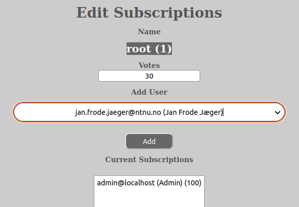

Remember that all changes needs to be committed by pressing the "Update"-button.
 
#### How to edit users

 4. Select the user you want to edit by clicking on him/her in the "Current Subscriptions"-dialog.
 
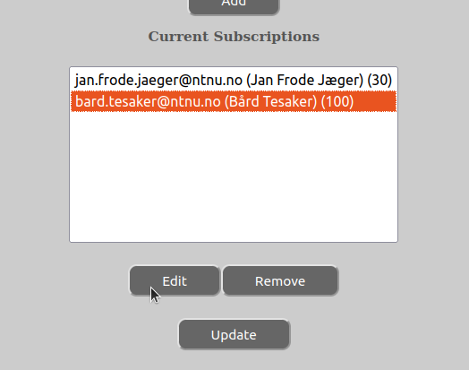

 5. Press the "Edit"-button to edit the user in question. A new window will then appear showing the users number of votes and the Notice-types that he are subscribing to. Usually new users will be automatically be subscribed to the "ALL"-type which means that one is subscribing to all Notice-types.
 
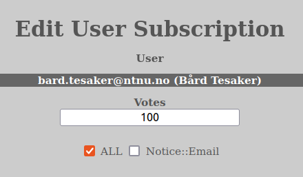
 
One can change the number of votes of the user here by updating the number in the "Votes"-input or change what Notice-types the user is subscribing to by selecting or un-selecting choices in the checkboxes that are visible.

You can close the edit user subscription window by clicking the "x" in the top-right corner.

Remember that all changes needs to be committed by pressing the "Update"-button.

#### How to remove user

 4. Select the user you want to remove from the "Current Subscriptions"-box by left-clicking it and then pressing the "Remove"-button.
 
Remember that all changes needs to be committed by pressing the update-button afterwards.
 
#### How to make the subscription changes take effect

In order for the changes you have made to the subscription on the given GROUP-entity in question take effect, you have to press the "Update"-button in the main part of the edit subscription windows:

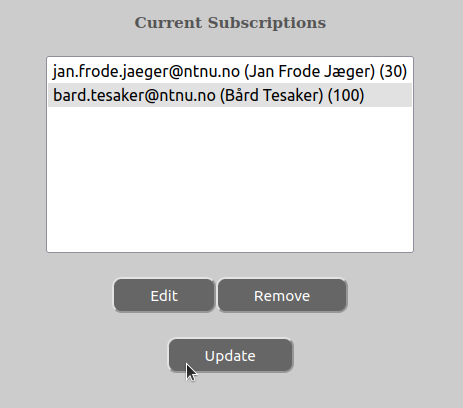

### How to edit template

This option is only available on a TEMPLATE. Its purpose is to edit the templates that either are or will be part of entity tree through template assignments (see the paragraph (How to assign templates)[#how-to-assign-templates)). AURORA have the ability to define any number of templates consisting of any number of key-definitions.

Templates and their settings are inheritied down the entity tree, so that a template assigned on top of the tree will have effect down to the bottom of it, if no other templates override its settings on the way down. The overrides do not happen per template, but per metadata key in the template, so that the aggregated result of templates are the aggregated collection of template's definition for any given metadata key.

Lets take as an example the metadata key for an entity's creator:

	.Creator

As you can see the metadata key start with a dot ("."). All open metadata must reside under "." and then something. Metadata above "." is considered system metadata and cannot be changed through normal REST-server metadata methods. Nor can this data be accessed through the REST-serves normal methods. It is therefore a rule in AURORA that all metadata defined by the user is to reside in "." namespace which is considered "open". Templates can define metadata anywhere in the namespace, but be careful with the differentiation between open and not open metadata if you want the user to be able to read and or change the metadata.

Furthermore, templates in and of themselves do *not* have any types (DATASET, GROUP, COMPUTER etc.). Templates gains validity for an entity type once it is assigned to that type (see the ["How to assign templates"-paragraph](#how-to-assign-templates)).

Now, once you edit a template there are the following fields to contend with for each metadata key that is defined:

- Name (metadata key name in the metadata namespace).
- Min (minimum number of values entered for the key, 0 means no minimum, 1-N means that number of minimum values).
- Max (maximum number of values entered for the key, 0 mean no limit, 1-N means maximum that number of values).
- Regex (the perl regular expression that checks/validates the values entered for this key).
- Comment (gives a textual explanation of the key and possible constraints).
- Flags (interpretative flags for the key. Will in many cases affect how it is used).
- Default (sets the default value(s) for the key).

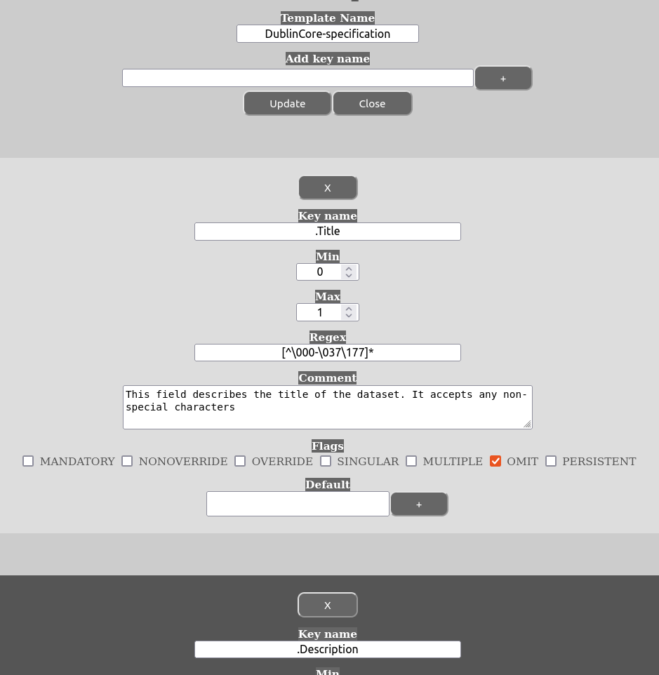

The meaning of the various flags are as follows:

- MANDATORY (the given key is mandatory and has to have a value).
- SINGULAR (the given key must consist of only one value from the default(s)).
- MULTIPLE (the given key must consist of multiple values from the defaults).
- NONOVERRIDE (the definition for the given key cannot be overridden).
- PERSISTENT (the value(s) entered for this key cannot be changed and are kept indefinetly - be careful!).
- OMIT (the given key is not to be used, basically define it, but hide it).

Please note that if a value is required (through MANDATORY) and none is defined, it will select the first element from default (if available).

As already mentioned, the PERSISTENT-flag should be used with caution. Once a value is set it is impossible to change it and the only way to circumvent the issue is to change the template that defined it PERSISTENT, update the value and then set the template back to PERSISTENT.

As can be seen, the use of multiple defaults can be used to define drop-downs and checkboxes by using the SINGULAR and MULTIPLE-flag accordingly. Please note that SINGULAR and MULTIPLE-flag at the same time is not allowed and SINGULAR will be preferred.

On top of the template-view one can see a heading called "Assignments". This expandable header will you an overview of where the template being edited has been assigned and as what type it has been assigned as (if any at all). This can be practical when planning what changes to do on a template and better understand their potential implications.

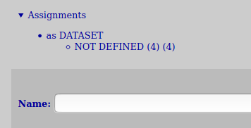

In general, be careful with giving too many people the permissions to edit or create templates. Defining them is a careful prosess and assigning them even more so. In addition it might lead to quite undesired results.

Some general steps:

- To add a new metadata key to template: write a new metadata name under "Add Template Key" and press "Add". Remember to be careful to only use "."-something if the metadata is to be open. Otherwise use the namespace over ".".
- To remove a key, press the "Remove" button on the side of the metadata key name in question.
- To add another default value, press the "+"-button on the side of the default value.
- To enable or disable any flags, check/uncheck relevant checkboxes on the metadata key in question.
- To change the name of a metadata key, just change the name in the metadata name input.

Please not that in the case of a metadata key that is both MANDATORY and SINGULAR, AURORA will select the first default value in the default-values defined if none is specified by user when entering metadata. This is how it satifies these requirements. Be therefore careful to add your desired default value first in the case of such scenarios.

When you are finished making changes, press the "Change"-button and the changes will be written to the database.

### How to move an entity

This option is available for: DATASET, GROUP, COMPUTER, USER, NOTICE, INTERFACE, STORE, TEMPLATE and TASK. The user must have the _MOVE permission (GROUP_MOVE, COMPUTER_MOVE etc.) on the entity being moved and the _CREATE permission (GROUP_CREATE, COMPUTER_CREATE etc.) on the new parent entity.

Please also remember that not all entities can be moved to any entity type that you would like. 

Here is a list of constraints:

- DATASET can only be moved to another GROUP-entity (the GROUP is the owner of the DATASET).
- GROUP can only be moved to another GROUP.
- COMPUTER can only be moved to a GROUP.
- USER can only be moved to a GROUP.
- NOTICE can only be moved to a GROUP.
- INTERFACE can only be moved to a GROUP.
- STORE can only be moved to a GROUP.
- TEMPLATE can only be moved to a GROUP.
- TASK can only be moved to a USER, GROUP or COMPUTER.

As you can see the restraint is centered around GROUP being the parent. These constraints reflect the restraint that you also have creating these entities.

You can select to move one entity or multiple entites at once. The procedure to do one or the other is the same:

1. Locate the entity or entities you want to move, then left-click it/their checkbox(es) in order to select it/them.

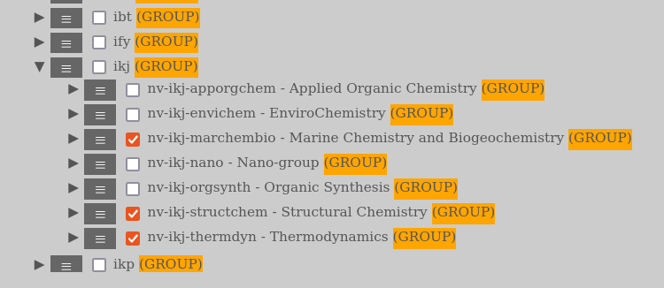

2. Locate the entity you want to move it/them to, then left-click its dropdown menu and select "Move Here".

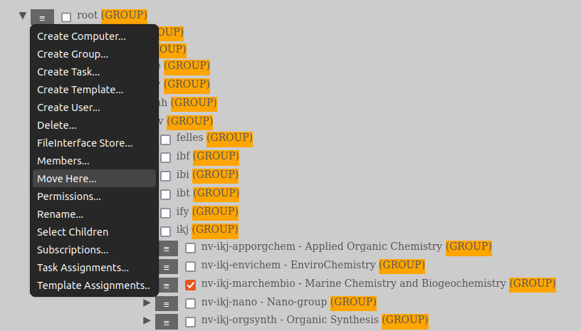

A new window will come up with information about the entity(-ies) that you have selected to move. Click the "Move"-button to proceed with the move. 

Please note that not all moving of entities might be allowed based upon everything from missing permissions to unallowed locations or combinations. Therefore consider carefully what you do before attempting to move the entity(-ies). 

### How to rename an entity

This option is available for: GROUP, COMPUTER, DATASET, TASK and TEMPLATE. The user must have the _CHANGE permission (GROUP_CHANGE, COMPUTER_CHANGE etc.) on the entity being renamed.

Please note that some entities might enforce rules as to what you can rename the entity to. An example of this is TEMPLATE-entities's name that has to be unique and even the name might be restricted by TEMPLATE-definitions (the constraints of the template definitions are not decided by templates, but the name of a template is located in its metadata and might have templates in effect for it).

In order to rename an entity do the following:

1. Go to the entity in the tree that you wish to rename.
2. Left-click the three horizontal lines to the left of the entity and the drop-down menu 
appears.
3. Select "Rename..." and left-click again. A window/tab appears with the rename window.

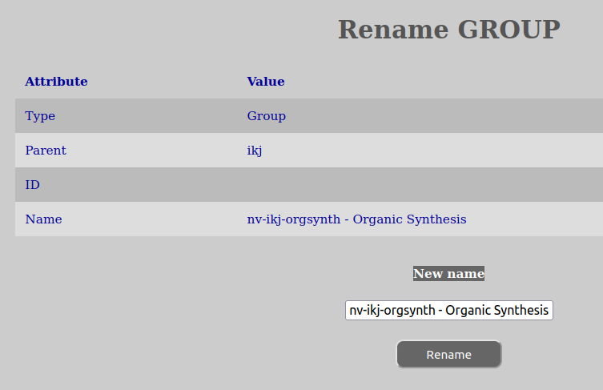

4. Write the new name that you wish to have and click the "Rename"-button to effect the change.

A new window should appear giving you a success message or it will inform of any issues with renaming you entity, such as missing permissions or invalid name. Please take steps to correct any issues and try again.

### How to search for an entity

Sometimes it might be difficult to know where in the entity tree an entity resides and therefore the web-client supports searching for entities by expanding the tree in relevant places. Please note that the searching mechanism is very rudimentary and is only meant to assist in finding what one is looking for in the tree.

You can search for an entity in two ways:

1. By entering the entity's unique ID in the search input.
2. By entering the entity's full or part name in the search input.

To search one enters the relevant information in the "Search for entity"-input box on the top of the "Manage Entity"-page and click "Search". 

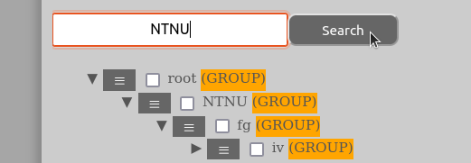

If one instead wants to search for an entity by its name, one enters the name of the entity in the "Search for entity"-input box. If one is uncertain about the whole name of the entity one is searching for part-names are also accepted.

Hits from searches will be shown in bold and the parts of the tree not already expanded will become expanded in the process. 

If one has problems locating the hits on the page, please use the search-option in the browser itself to find it on the page.

### How to work with scripts

AURORA has the ability to perform tasks by running scripts written in the Lua language (see [here](https://www.lua.org/docs.html) for documentation of lua). Lua has been completely embedded within the AURORA web-client and can be used to write scripts that perform any task with complete interface to the AURORA-server REST-API (see [here](../../docs/technical/AuroraRestServer.html) for a documentation of all this).

#### General

In addition to the lua functions and language, some extra library functions have been defined as follows:

- dumper(var) - function to dump the structural contents of a variable, if any. Handy to inspect whats inside data being handled.
- aurora(methods,params,notify) - function to call the AURORA REST-API and return the data generated inside. The function halts the execution of the lua code until a value has been returned. Returns a table if successful with keys and values (see the AURORA API documentation for structure).
- readstr(msg,def) - function to read input from the web-client and return inside the lua code being executed. The function halts the execution of the lua code until a value has been returned.
- print() - function to print out to STDOUT of the web-client script dashboard.
- indents(n,m) - create the number of indents as specified.
- split(str,sep,limit) - split a string into an array based on separator and limit. Interface directly to javascript split.

All these functions above can be used in your own Lua language scripts. Because some of the code of these functions are included inside the Lua script that you are running, the start line of the code will never be line 1. The only code showing in the window that is being edited is the code for the script being created. The rest has been hidden away as system code.

Example of lua code that calls the AURORA API:

	-- Create the table/hash that contains what we are asking for	
	params={};
	params.id=1;
	-- call aurora's getName API method and include the parameters table
	mydata = aurora("getName",params);
	-- print the complete contents of the return data in mydata
	print (dumper(mydata));
	-- address and print just one value from the return data
	print ("Name: " .. mydata.name .. "\n");

Example of lua code that asks for input to the script:

	-- ask for input and return what you get. Set the message to be displayed 
	-- as well as the default value for the return
	value=readstr("What is your name? \n","John Doe");
	print ("Hello " .. value .. "\n");

Observe that the message to be displayed when getting input contains a new line character. This is because the question will be shown in the script execution window of the AURORA web-client and it needs a new line here in order to avoid line output ending up on the same line. It has no consequence for the input itself in the web-client. That input is handled by a text input dialog of the GUI.

#### How to create a script

In order to be able to create a script, you have to have the SCRIPT_CREATE permission the group entity that is to be the parent of the new script.

To do this, go to a group in the entity tree where you want to create the script:

1. Left-click the mouse over the group entity's dropdown menu and select "Create Script...":
2. In the create-window that appear, write the name of the script as whatever you would like.
3. Click "Create Script".

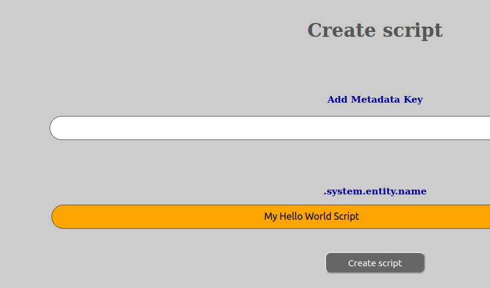

If you have the correct permission, a new script will be created.

#### How to edit a script

In order to be able to edit a script, you have to have the SCRIPT_CHANGE permission on the script in question.

In order to edit a script do the following:

1. Left-click the mouse on the dropdown of the script in question and select "Dashboard...". 
2. Sit back and wait for it to open.

Inside the script dashboard, you will have the edit window on the right, with a column of numbering on its left side that helps to show where you are in the code. Please again be aware that the numbering do not start on line 1 and this is due to auto-included functions (see above).

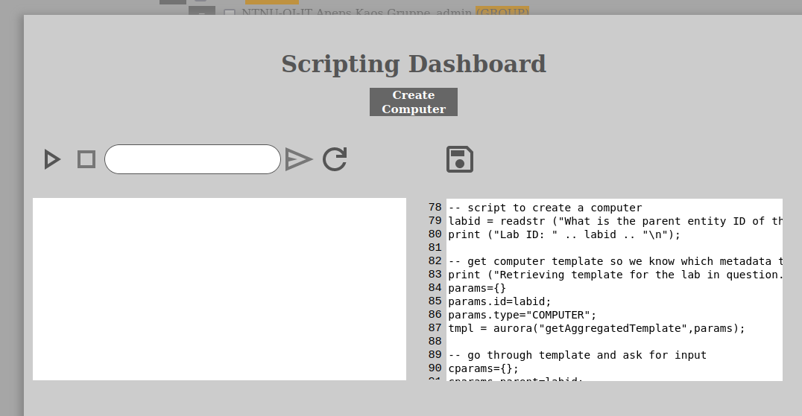

You can now edit the script as you want to in the window to the right.

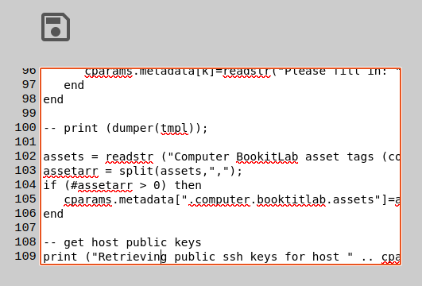

#### How to run a script

Everyone can in theory run a script, but before you run it, you have to be able to read it/get it. So running scripts therefore requires that one has either the SCRIPT_READ or SCRIPT_CHANGE permissions on the script in question.

To run a script, do the following:

1. Left-click the mouse on the dropdown of the script in question and select "Dashboard...".
2. Wait for it to open.

Inside the scripting dashboard you will have the run window on the left with some buttons placed above it. These buttons are for running. stopping, the input text box, sending input and reloading the script.

The button to the uttermost left is the play-button. The next button to the right of it is the stop-button. Then comes the input dialog followed by its send-button to send the answer into the lua code being run. At the end is the reload-button which will reload the code being run.

The execution can be permanently stopped at any point while being run, even if the lua engine is asking for input and waiting. The reason for the reload-button is that the edit-window (to its right) and the run-window are two separate windows and one can choose to edit the code without it being updated for whats being run. So whatever has been edited, must be saved before it is then reloaded in the run-window and then run.

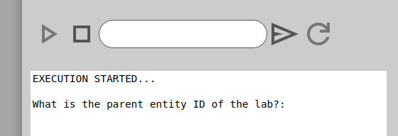

When the script is running you can follow what is happening in the window below the toolbar.

#### How to handle input to the script

When a lua script is running in the scripting dashboard it will sometimes ask for input that are relevant to the script. When this happens the execution of the script halts and one is expected to answer in the text box that are together with the play-, stop-, send- and reload-buttons on the toolbar.

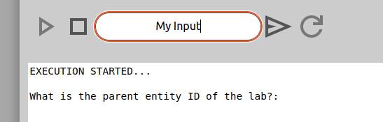

When input is being written, one just clicks on the input box and then writes whatever one wants to and then hits enter or clicks the send-button on the right side of the input box. This will inject the text from the input box into the lua engine.

Sometimes the input box will also contain a default value when the lua engine stops and waits for input. This will then be default value supplied by the readstr-function of the lua-code.

### How to set dataset lifespan policies

In order for the the AURORA-system to know when a dataset is supposed to expire, it needs to have this information when creating datasets. For this to happen it needs to be defined socalled "lifespan"-policy(-ies) in the entity tree. These policies are templates with settings in the namespace for the lifespan- and expire settings. In order to adjust the expire time of a dataset, the user needs to have the DATASET_DELETE-permission.

These settings are located in the keys called:

	system.dataset.open.lifespan
	system.dataset.open.extendmax
	system.dataset.open.extendlimit
	system.dataset.close.lifespan
	system.dataset.close.extendmax
	system.dataset.close.extendlimit

so in order to define this policies, one has to create templates that sets a default value for these keys. The same settings exists for both "open" and "close" status of the dataset. The reason for this is that one can have the dataset exist for a certain amount of time in an open status before the AURORA-system triggers a close-dataset notification that the user(s) have to take into account. The reason for this mechanism is that all datasets should at some point be closed. 

The "system.dataset.open.lifespan" sets the number of seconds that a dataset is to exist after it has been opened and before it is closed. The "system.dataset.open.extendmax" sets the number of seconds that the user(s) are allowed to extend the open dataset when asking for an extension upon eg. the dataset being asked to close. The "system.dataset.open.extendlimit" is the maximum number of seconds the dataset can exist after which the dataset cannot be extended anymore by the user(s). After the maximum extension limit 
has been met, the only way to prevent an open dataset from eventually being closed is either to discard it or have a user with the DATASET_EXTEND_UNLIMITED-permission on the dataset in question.

The "system.dataset.close.lifespan" sets the number of seconds that the dataset is to exist after it has been closed. The "system.dataset.close.extendmax" sets the number of seconds that the user(s) are allowed to extend the closed dataset when asking for an extension upon eg. the dataset being ready for expiration/removal. The "system.dataset.close.extendlimit" is the maximum number of seconds the dataset can exist after which the user cannot extend it anymore. After the maximum extension limit has been met, the only way to prevent a closed dataset from eventually being removed is to have a user with the DATASET_EXTEND_UNLIMITED-
permission on the dataset in question.

It is natural that the limit-setting for an open dataset is much lower than for a closed one (although it is completely flexible). Here are some example settings:

	system.dataset.open.lifespan       = 259200 # three days
	system.dataset.open.extendmax      = 86400 # one day at a time
	system.dataset.open.extendlimit    = 604800 # maximum extension time is a week after open
	system.dataset.close.lifespan      = 2592000 # a month after closing the dataset
	system.dataset.close.extendmax     = 1209600 # you can extend for up to 2 weeks at a time
	system.dataset.close.extendlimit   = 15552000 # you cannot extend for more than 6 months
   
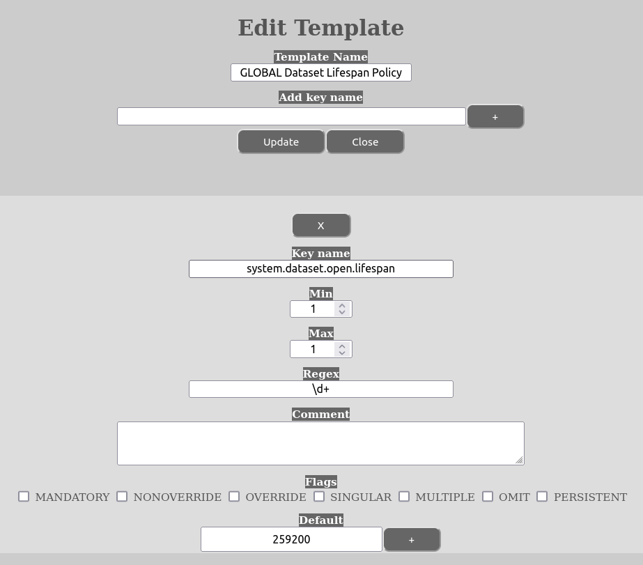

When the template has been created and defined, one has to assign the template where one wants it to have effect in the entity tree. It is also possible to set these settings in different templates if so wished for. The settings will then be inherited down the tree from where they were assigned, except if another template or templates happen to override it.

Please note that even though the settings will be written to the metadata of datasets, when it is being used it will only be read from the templates and not the metadata. Also take care that when assigning such templates that they are assigned as being valid for the entitytype "DATASET". Also take care not to enable any of the template-flags, except "NONOVERRIDE" if that is desirable in any situation. The reason for not choosing any of the others is because this settings is not supposed to be editable metadata, but taken directly from the templates, so to avoid any issues it is best to not tick any of these flags.

For guides on how to create and edit templates, see the [How to create an entity](#how-to-create-an-entity) and [How to edit template](#how-to-edit-template)-paragraph. For assigning templates, please see [How to assign Templates](#how-to-assign-templates).

By defining and assigning such templates one can control the lifespan policy down to the individual owner groups of datasets if one chooses to.

### How to set notification interval policies

In order for the AURORA-system to know when to notify the users about datasets that are about to expire, one needs to set interval policies. These are defined in the form of templates assigned to the entitytype "DATASET".

The namespace for the setting is in the key:

	system.dataset.notification.intervals

so in order to define these intervals one has to create template(s) that set default values for these intervals. This is done by assigning multiple values on the default-setting of the template.

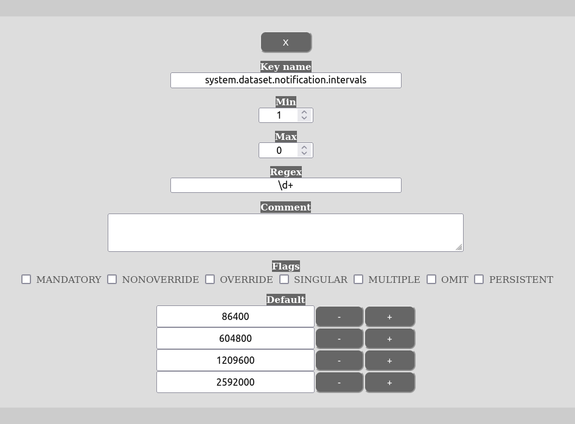

Please note that one does not need to have the default values in ascending order. The order of the notification intervals are not important. Please also avoid setting any of the template flags, except NONOVERRIDE if that is needed in any situation. The reason for this is that the settings in this template are used as a template and not as metadata.

For guides on how to create and edit templates, see the [How to create an entity](#how-to-create-an-entity) and [How to edit template](#how-to-edit-template). For assigning templates, please see [How to assign templates](#how-to-assign-templates).

By defining and assigning such templates one can control the notification interval policies down to the individual owner groups of datasets if one chooses to.

### How to set remote control policies

In order for the AURORA-system to allow for remote controlling its computers, one needs to set one or more remote control policies. These are defined in the form of templates assigned to the entitytype "COMPUTER".

The namespace for the setting is in the keys:

	system.gatekeeper.host
	system.gatekeeper.keyfile
	system.gatekeeper.knownhosts
	system.gatekeeper.protocols.RDP
	system.gatekeeper.protocols.VNC
	system.gatekeeper.script
	system.gatekeeper.username

The host-setting is the host-name of the gatekeeper-server that is running the gatekeeper-service. The keyfile-setting is the name of the private keyfile to use when connecting to the gatekeeper-server. The public part of that key needs to be registered with the gatekeeper-server in the user of choice's authorized-keys-file. The knownhosts-setting is the public key of the gatekeeper-server (it should be in the format of: host-name knownhosts-value). The host-name in knownhosts must match the host-name in the host-name parameter. The script-setting is the script to run on the gatekeeper-service to create/open the tunnel. The "username"-parameter is the username to use when logging into the gatekeeper-service with SSH and running the gatekeeper-script.

Lastly, the system.gatekeeper.protocols.*-settings are the valid connection protocols for the template. It can be any name that one wants after protocols., but they need to be uppercase. The value part of each key in protocols.* is the port number of the protocol in question, so that eg. the VNC-protocol would be:

	system.gatekeeper.protocols.VNC = 5900

Please note that not any of the template-settings for remote control should use any of the template flags. Do this and you might have unintended side-effects and problems.

### How to edit template assignments

This option is only available for GROUP-entities. In order to assign template you need to have the permission *GROUP_TEMPLATE_ASSIGN* on the GROUP-entity in question.

One can assign any number of templates that one wishes on a GROUP-entity. The templates will take effect in the order that they are assigned and the last TEMPLATE-entity in the list will take precedence for any given metadata key that are defined several places in that list. The order of the list can easily be changed in the assign template view.

Please also be aware that templates in and of themselves are neutral and it is only when you assign them that they must be assigned as having effect for an entity type. A template can be assigned on any GROUP entity that one wish to and for differing entity types at the same time (but ensure that you do not create too much chaos in your entity tree and that it comes back with a vengeful karma).

In order to assign templates do the following:

 1. Locate the GROUP-entity in the “Manage Entity Tree” view that you wish to assign templates to.
 1. Left-click the three horizontal lines to the left of the GROUP-entity and select “Templates…”. A new window appears with the assign template window.

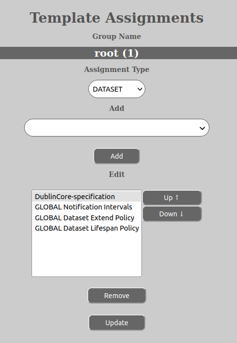

 3. In the assign template-window that appear, select which entity type that you wish to edit assignments on (“Assignment Type”-dropdown). DATASET is the default entity type and if you select another it will show you any existing template assignments for that type.
 1. Go to the “Add”-dropdown input and search and/or select the template that you wish to assign.
 1. Press the “Add”- button to add the template to the assigned templates box.

At this point it might be that you wish to rearrange the order of the template assignments (see above). It might also be that you do not wish to assign any new template, but that you only wish to change the assignment order.

In order to change the template assignment order do the following:

 1. In the “Edit”-box select the template that you wish to change the order of.
 1. Press either the “up” or “down”-button to move the selected template into the place you wish it to be. Press it several times to incrementally move the template into its correct place.

When you are satisfied with the changes you have made, press the "Update"-button to save the changes and make them active.

### How to edit tasks

This option is available for: USER, GROUP and COMPUTER. The user must have the TASK_CREATE permission on the entity in question (USER, GROUP or COMPUTER).

Tasks are a way of defining distribution policies in AURORA. They tell the system where to fetch the data for the dataset (in case of automated acquire datasets) and where to put them (in the case of both automated acquire- and manual acquire datasets). It can even define deletion-processes.

The tree sub categories and order of execution of a task is:

 - Get (fetch data from a remote area or computer when dataset is open and of an automated type).
 - Put (put data to a remote area or computer after dataset has been closed, both manual/automated type).
 - Del (delete data from a remote area or computer after dataset has been closed, both manual/automated type).

When a automated acquire dataset is being created, the AURORA system probes the path from (and including) the COMPUTER being the source of the dataset and up the entity tree to find the first available task. If it on any of the entities find one or more tasks, it will select the first task with which alphabetically comes first and use that as the main task for the get-, put- and delete-operations of the dataset. Furthermore, it will combine the data in the task with metadata from the COMPUTER, such as host-name and other parameters to form a complete set of parameters to perform whatever operations has been defined by the task.

In addition to this, it will also search the owner group of the dataset and the user being the creator of it, for any task assignments on the COMPUTER in question (see ["How to edit task assignments](#how-to-edit-task-assignments)). If it finds any assignment(s) here it will take those tasks’ put- and del-definitions (not get) and add to the put- and del-definitions from the task first selected as the main task. So, in other words, this mechanism enables the owner group and the user creating a dataset to have their own policies on where the dataset is to be copied after it has been closed. The put- and del-operations will only be run once the dataset has closed. Therefore they will also be executed for manual acquire datasets.

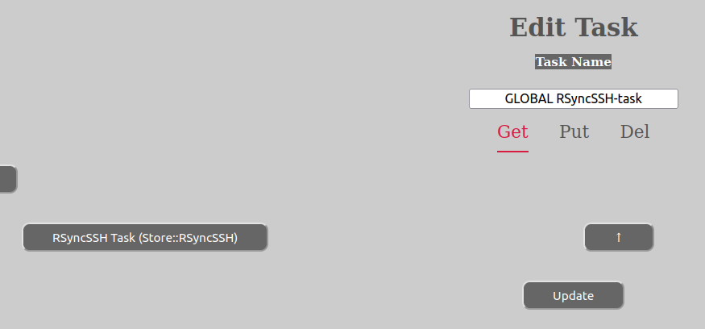

If you only want to do certain operations of a task’s sub-categories, only define data for that category and no one besides this. In the example above, only one “get”-operation has been defined ("RSyncSSH Task") and it is general, since it does not define the host-name or any host-parameters (which are taken from the COMPUTER metadata using this task).

For a user it makes sense, to only define put-operations. There is no way right now for the user or dataset owner group to define any get-operations, since the get-part is defined globally at the top of the entity tree. We aim in the future to provide the possibility of executing tasks manually outside the create dataset workflow. Right now this is not possible.

You can define as many get-, put- or del-operations that you want in one, single task. Also note that within the sub-category (get-, put- or del) the order of the operations matter, since the topmost one will be executed first.

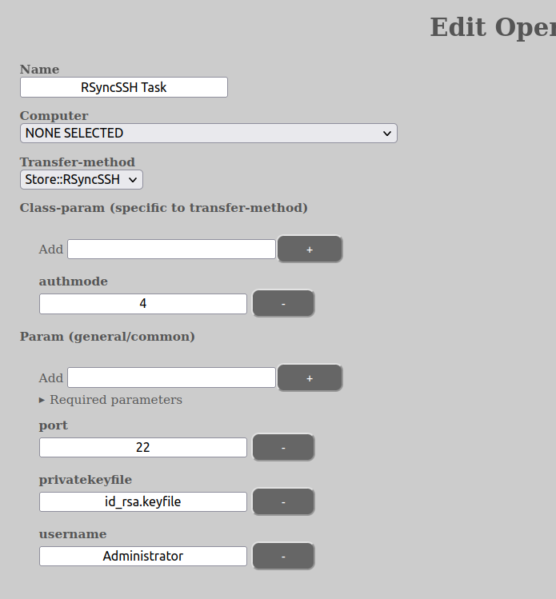

The name-parameter of an operation (not the name of the task itself) is just a label for the user and has no value to system itself. The Transfer-method parameter says which transfer protocol is to be used. The most common one is the Store::RSyncSSH, which is the safest and preferred method. We aim to also provide access to cloud protocols in the future, such as OneDrive, GDrive etc.

Another important parameter is computer, which potentially defines which computer the operation is to be performed on. This parameter can be “NONE SELECTED”, which means that none has been set. In the case of running a task as part of a “create dataset” event, the computer will be filled in by the REST-server no matter what the task may say in the first get-operation. For other operations, it needs to be filled in and the computer to be registered in AURORA.

In addition to these, you have two parameters with sub-parameters called “class-param” and “param”. “class-param” are parameters to the Store-class itself (ie the transfer-method class). Usually it is enough with the “authmode” parameter here (see below for an explanation). The “param” parameters are parameters to the Store-class when connecting to the COMPUTER in question. This can be anything, but the most common, as the image above shows, is port, authentication information (in this case the private ssh key used) and lastly the username being used to connect with. All of these parameters, including the ones in class-param, can be overridden by the metadata of the COMPUTER in question.

You can also get the edit task view to show you which “param” are necessary given any set “class-param” of the chosen Store-class (transfer-method). This is achieved by setting the class-param that you want to have, then let the view update itself and then expand the caret called “Required parameters”. It will show you which key(s) are required and what are the defaults if not specified. It will also show you the regex-requirements for the param key (for those of you who happen to be lucky enough to have achieved fluency).

In the example above, the rest of the information in “param” is provided by the COMPUTER-metadata, such as the host and the public key certificate.

As goes the mentioned “class-param” called “authmode”. It is valid across all the Store-classes and defines how the authentication with the host is performed. Valid modes are digits 1-4 (although not all might have meaning to all Store-classes):

 1. Password (it is expected to provide a param called “password”).
 1. Password-file (it is expected to provide a param called “passwordfile”).
 1. Authentication key (it is expected to provide a param called “privatekey”).
 1. Authentication key-file (it is expected to provide a param called “privatekeyfile”).

It is advised that the expected parameters of these 4 modes are provided in the COMPUTER metadata if tied to a COMPUTER in the entity tree. So, in other words, set the authmode in the task, but let all required parameters of authmode be set in the metadata of the COMPUTER-entity.

Please also note that if you use password-files they have to have names that end in “.pwfile”. For certificate-files the private-key needs to end in “.keyfile”. Furthermore, all of these types of parameters are sandboxed and can only fetch files from within the location specified in the sandbox-parameter of the AURORA-system. This means that these parameters are only for administrators and we advise users to not use password- and/or certificate-files in their tasks. We also urge administrators with being careful about using password-files, since all users can create tasks and in that way access all your password-files in the sandboxed area and potentially deliver that password as a password to a server they control and in this way be able to access your password and thus potentially compromising your servers.

But their ability to access computers with your certificate-files are limited, since it requires them to also have the COMPUTER_READ-permission on the computer they are attempting to access.

Please note that tasks have permissions on them and are not readable without the correct permissions by any user. However, we still strongly advise caution with saving passwords and authentication details in the task. We advice against using AURORA as a authentication repository since the side-effects in the event of a security breach can be huge.

In the case of connecting to services that allow tokens or access keys to be generated (such as cloud-services like DropBox, OneDrive and so on and so forth), we advise that you instead create such token(s) for a part of the service and store that in the task, so that even if the task-data is compromised you do not compromise your whole cloud acccount.

Common params to know about with Store-types (all are lower case):

 - host (hostname of computer to get/put data from/to).
 - knownhosts (entry for the public certificate of the host you are connecting to in the ssh knownhosts-format).
 - remote (remote path to get/put data from/to). In case of automated datasets, the remote-parameter is filled in automatically during the get-operation. One can still fill in the user-part of the path here and the Store-service will use that together with the data root for a given computer to form a complete path. Please note that any “..” or attempt to move outside the computer data root will be squashed.
 - username (username to login as when connecting to host).

Not all of these are necessarily used by the Store-type in question, but they are recurring in several. The parameter “remote” is always there, but it is being auto-filled when running get-operations as part of creating a dataset. “remote” always signifies the remote computer, independent upon if the operation is get, put or del.

These permissions are needed on the computer in question to run the various operations:

 - get (COMPUTER_READ)
 - put (COMPUTER_WRITE)
 - del (COMPUTER_WRITE)

### How to edit task assignments

This option is only available for USER- and GROUP-entities. Its purpose is to assign existing task(s) to computer(s).

In order for the research group (or any group, except roles) or user to define what is to happen to the dataset after it has been closed, it is possible to assign task(s) to the computer that is the target of the dataset (both manual acquire and automated acquire ones). The tasks assigned in this way will have their “put” and “del” parts added to the distribution task of the dataset, so that they can in this way constitute a distribution policy for the user or the group in question. Multiple tasks can be assigned at the same time.

The user task(s) are only added from the user that creates the dataset. The assigned tasks from a group is only added if the owner group is the same as the assigned group. In all other cases they are not used.

This means that if you create a dataset yourself and you specify that the dataset belongs to “My Group” and that you are creating the dataset from “Computer A”, only tasks that have been assigned for your user to “Computer A” and tasks assigned for “My Group” to “Computer A” will be used for the “put”- and “del”-definitions for that dataset (check the documentation on ["How to edit tasks"](#how_to_edit_tasks) for more information). These parts of the task will be run as soon as the dataset has closed.

In order to assign such tasks do the following:

 1. Go to the user- og group entity that you wish to assign tasks for.
 1. Right-click on the three horizontal bars to the left of the entity and in the drop-down menu that appears , choose “Task Assignments…”.
 1. A new window will open with the “Task Assignment” options. First select the computer(s) that is/are to have the assignment set for it (in the “Add Computer” input-box).
 
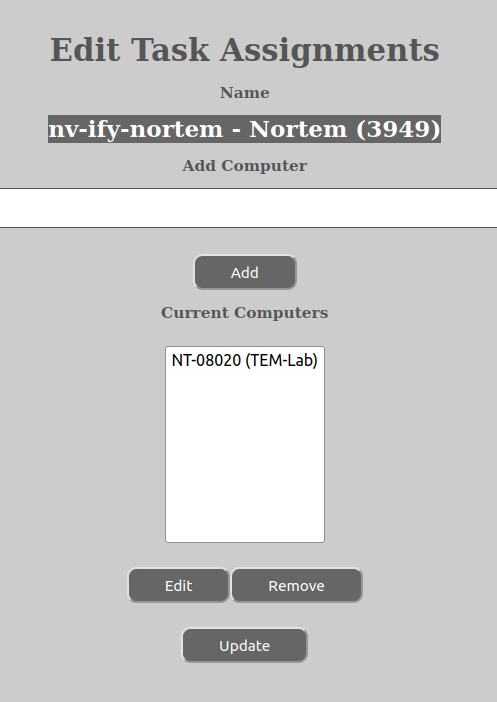
 
 4. Select the newly added computer in the "Current Computers"-box and click the Edit-button. 
 1. A new window appear that shows the task assignments.
 
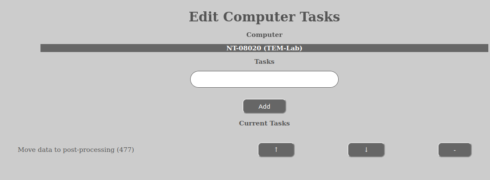

 6. In this window you can add new tasks to the computer chosen by searching and adding them through the "Tasks"-dropdown when clicking the Add-button.
 1. All added tasks can be sorted in the order that they are to have effect. This is done by clicking the up- or down-arrows as needed to the right of the task-name.
 1. Tasks added can be removed by clicking the "-"-button.
 2. Exit the task assignment window by clicking the "x" in the topmost right corner of it.
 1. When you are finished to add computers and define tasks on those computers, click the "Update"-button to save the changes and put them into effect.
 1. Click the "x" in the topmost right corner to exit the task-assignments edit window.
 
