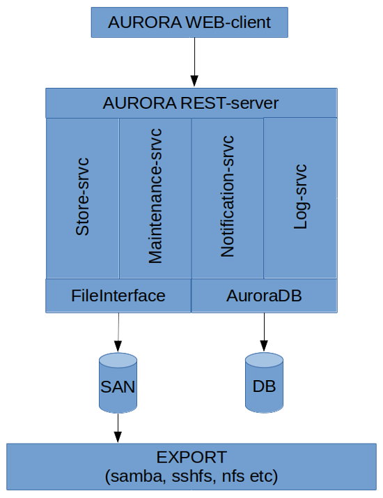
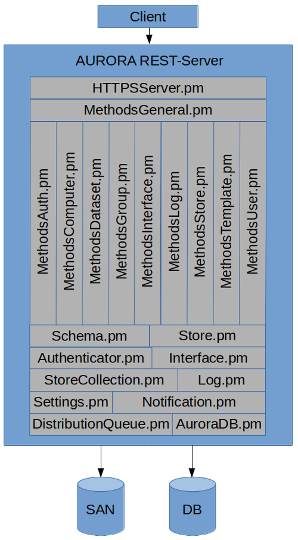
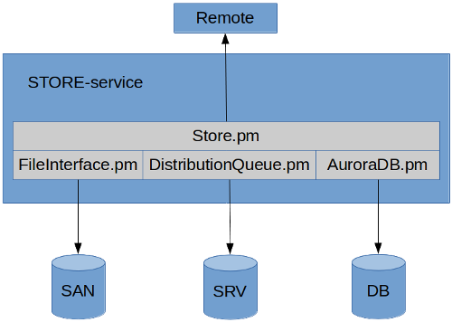
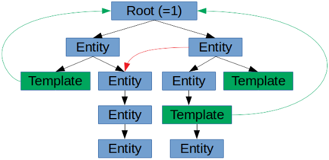

<!--
        Copyright (C) 2019-2024 Jan Frode Jæger <jan.frode.jaeger@ntnu.no>, NTNU, Trondheim, Norway

        This file is part of AURORA, a system to store and manage science data.

        AURORA is free software: you can redistribute it and/or modify it under 
        the terms of the GNU General Public License as published by the Free 
        Software Foundation, either version 3 of the License, or (at your option) 
        any later version.

        AURORA is distributed in the hope that it will be useful, but WITHOUT ANY 
        WARRANTY; without even the implied warranty of MERCHANTABILITY or FITNESS 
        FOR A PARTICULAR PURPOSE. See the GNU General Public License for more details.

        You should have received a copy of the GNU General Public License along with 
        AURORA. If not, see <https://www.gnu.org/licenses/>.
-->
# AURORA SYSTEMS OVERVIEW

## 1. INTRODUCTION

AURORA or Archive Upload Research Objects for Retrieveal and Alteration is a science data 
storage and retrieval system meant to keep track of science data generated and attach 
relevant metadata to them.

It features:

- The ability to download data from laboratory computers in the background after they have been generated (socalled automated acquire).
- The ability to download data from laboratory computers while its being generated (socalled manual acquire).
- The ability to add dynamic metadata to the stored datasets. The limit to the metadata is only in terms of database size and practical limits as it is completely flexible.
- A rich and flexible ability to define permissions for datasets, including adding them to research groups and other organizational units. This means that datasets will be owned by the group, not the user which makes the management of them better and safer.
- The ability to automatically copy the stored dataset on to other locations by policy.
- Offers an easy to use web-interface to the stored datasets, creating new datasets, viewing and editing metadata,
- Offers plugin support for transport protocols both to and from locations. The support now includes: FTP, SFTP, SCP, RSync over SSH and Samba/CIFS. In the future it will offer support for the most popular cloud platforms like OneDrive, Google Drive, Amazon S3 etc.
- Offers plugin support for dataset access/retrieval. The support now includes: Samba/CIFS, ZIP- and TAR-sets, URL/Web-access.
- Supports most major platforms: Windows, Mac OS, Linux, Unix etc. Most functionality is available through web-interface or standardized transport and retrieval protocols.
- Utilizes standardized and established technologies for data transport and storage that are also open source and thereby offering high uptime and low cost.
- Better security for science laboratories by eliminating the need for external HDs or USB drives to move data out of the lab.
- Automatic notification of upcoming deletion and deleted datasets. Also when notifications are not received or confirmed, the system will automatically escalate the notification to the group(s) that owns the datasets in a hierarchical fashion.
- Standardized REST-interface to the AURORA-system that easily can allow new services and systems to access it. 
- Free to use.

AURORA is the name for the system in general, but also more specifically for the REST-
server itself that offers an interface to all the functionality. However all the various 
services that constitute the system is also a part of AURORA and vital for its functionality. 
The AURORA name will therefore in this document be used to interchangeably mean these 
various parts and the system as a whole.

The main components of the AURORA-system is:

- AURORA REST-server (the REST-server with the external interface to the system)
- AURORA Store-service (queue based service that handles the moving of data from and to locations)
- AURORA Log-service (handles all log events from the various parts of AURORA)
- AURORA Notification-service (handles all notification events from the various parts of AURORA)
- AURORA Maintenance-services (sub-group of services that handles expiration and deletion of datasets, general cleaning and administration)
- AURORA WEB-client interface (the WEB client that interfaces to the AURORA system)

In addition it utilizes various technologies for data storage and transport. The AURORA-system 
is written to be database independent and uses standardized SQL. Under development and use the 
system has been using MySQL for database storage. The data has been stored on SANs from 
NetApp offering WAFL, but the only requirement is a storage solution offering NFS and/or 
POSIX-compliant filesystem interface.

No MySQL specific SQL has been used in the library that interfaces with the database and should 
work equally well with MySQL as with Oracle or SQLite. There are obviously certain speed and 
optimization sides to this issue, but it should work. As of the writing of this document we have 
not tested AURORA on any other database engine than MySQL.

In this diagram is also included the libraries FileInterface and AuroraDB. They are not services 
or parts of the AURORA-system like the other one, but libraries that are essential to the workings 
of the AURORA-system and are used by all of the various parts (either both or just one).

The FileInterface-library is the interface with the stored data and it allocates folders for the 
datasets and handles the various states of the storage. The AuroraDB-library is the abstraction 
on top of the database that essentially creates the AURORA-type database with its qualities of 
entities, templates, permissions and so on. All interaction with the database is done through 
this library.

AURORA has been completely written in the (rather archaic?) Perl programming language. When it 
comes to data transport it uses established unix/linux utilities for this which are wrapped in a 
Store-class that creates a standardized abstraction level. We have not wanted to create our own 
implementation of these protocols. All storage level solutions uses a POSIX-compliant filesystem.

All Perl modules that have been created and are part of the AURORA-system have been extensively documented 
with POD. Rendered HTML-versions of the POD document embedded in the various AURORA libraries have been 
included with the distribution. In addition there are a rich set of documentation available written in 
markdown.

We will now go through the various sub-parts of AURORA as outlined above in the diagram and describe their 
general workings and what sub-parts they consist of. The description will start at he higher level with the 
AURORA WEB-Client and go from there down to the lowest level with the database and storage.

## 2. AURORA WEB-Client

The AURORA WEB-client is the main working interface to the AURORA-system. Here the users or administrators 
can create datasets, manage datasets, manage the entity tree and their accounts. All of the WEB-client 
functionality interfaces with the AURORA REST-server. It does very little checking of values and what is 
allowed or not. This security check is done and upheld by the REST-server.

Even the credentials used for logging into the AURORA REST-server requires the web-interface to login 
each time in adherence to the stateless design-purpose of the REST-ideology. When trusting other sources 
for login, such as OAuth, the AURORA WEB-client does not have any administrative or special access to 
the AURORA REST-server. The REST-server even checks these credentials itself for each call to ensure 
that the actions being performed are permitted. The WEB-client is in other words not trusted by the 
REST-server.

The AURORA WEB-client basically consists of:

- An Apache web-server.
- A Javascript bundle that are loaded by the web browser and run locally on the users computer.

The WEB-client is written in Svelte using javascript with typescript and CSS controlling the styling. 
The goal has been to create a WEB-interface that works in most browser, even older ones, while still 
retaining a certain level of pleasing design.

For the user-documentation on the web-client, see:

[AURORA-system user-documentation](../user/index.md)

## 3. AURORA REST-Server

The main component of the AURORA-system is the REST-server. It offers interface to all of the 
functionality of the AURORA-system with the exception of data sharing, which is handled by 
standardized protocols (both for putting and getting data). The exception to data sharing is 
processes that are handled as automated acquire processes (both acquire and distribution) that happens 
in the background and are initiated by the REST-server (and handled by the AURORA Store-service).

The REST-server has been built on its namesake REST-design principles but uses only POST- and 
GET-calls. We have not seen any necessity in diversifying the calls based upon what it does (such 
as eg. DELETE, PUT, UPDATE and so on and so forth). We also do not use the hierarchical path-
design that are used in REST-servers, so that the REST-method is the only part of the path, such 
as eg: https://aurora.domain.ntnu.no/createDataset and the data input is delivered with a JSON 
structure. The result of operations are also delivered as a JSON-structure.

The REST-server is also stateless-ish. This means that you can choose to connect to the REST-
server and use the HTTP keep-alive flag and in this fashion not be completely stateless. This 
ensures that connection is up and certain working values are cached by the server. All calls 
still need to include the necessary authentication to work, but much used values in the AURORA 
database is being cached, such as entity type IDs, permission trees and so on. 

The reason for this behaviour is that the database instance is being kept open as long as the 
connection is up and the server can only process one REST-method at a time for each connection 
thereby reusing it for each call. The caching mechanism is very basic and it not meant to be a 
sophisticated design. But, because of this it is possible to expect increased performance if the 
keep-alive flag is enabled and the connection is kept up. It should also be noted that most likely 
will keeping the connection with the database engine mean that it also optimizes its performance 
for that session.

This advantage though, is not used by the AURORA WEB-client because of the way the fetch-call is 
implemented in javascript it does not utilitze the keep-alive flag.

Every method in the REST-server start with a verb, such as create, get, enum and so on. The 
server also enforces HTTPS and requires the use of SSL and certificates.

All input is systematically checked through a Perl module called Schema.pm. It contains small 
routines that check the data and enforces correct formatting and/or removing unwanted input. All 
REST-methods uses this module to check and clean the input it is receiving.

The main sub-parts of the REST-server are:

- Authenticator.pm (handles authentication to the REST-server).
- DistributionQueue.pm (creates tasks for handling acquiring- and distributing data).
- HTTPSServer.pm (handles client connections and is the main run-loop of the REST-server).
- Interface.pm (handles rendering and getting information on interfaces to stored data).
- Log.pm (handles sending log-events to the Log-service – drop and forget).
- Notification.pm (handles sending notification-event to the Notification-server – drop and forget).
- Settings.pm (handles getting configuration settings for the REST-server).
- AuroraDB.pm (handles all contact with the database. This library is the AURORA system).
- StoreCollection.pm (handles management of storecollections between metadata and hash, also called tasks).
- Store.pm (handles transport of data and also listing contents).
- Schema.pm (handles checking and cleaning of values).
- Methods (Auth, Computer, Dataset, General, Group, Interface, Log, Store, Template, User, Task, Notice).
      
The REST-server design is as follows:

This diagram is not exhaustive and there are more sub-classes and some minor modules/classes that are 
part of the REST-server itself.

The HTTPSServer-module is the main server-loop of the REST-server. It listens for connections and forks 
out processes to handle those connections. Because of scalability and recommendations in the 
documentation of the modules used for this, the server initially accepts connections in HTTP-mode. 
When a successful connection has been made it attempts to upgrade to a HTTPS/SSL-based connection. It 
then does authentication of the user by using the relevant Authenticator-module and upon successful 
authentication attempts to execute the REST-method asked for if it exists. The forked process exists as 
long as the connection is open with the keep-alive flag.

The Methods-modules basically defines the various REST-methods available. All of them can use general 
methods defined in the MethodsGeneral.pm-module. These methods are called from the main server-loop in 
the HTTPSServer-module. Most of the subdivision of these modules reflects the defined entity types 
available in the AURORA database (but not all).

The Authenticator-module is a placeholder class for authentication methods to the REST-server. It allows 
for plugin-based authentication modules to be written for any authentication method that one wants to 
support. As of writing there exists 2 sub-classes: AuroraID and OAuthAccessToken. AuroraID is 
the main authentication type of the REST-server while he OAuthAccessToken-class 
support authentication through an OAuth enabled service. We are using FEIDE for this. All USER-entities in 
the AURORA-system has a unique ID. However, the unique identifier of any user in the system is his or her 
email-address when authenticating with the REST-server.

The Interface-module is a placeholder class for interface types to the datasets data. That means it enables 
the implementation of ways to give access/sharing data in the AURORA-system and/or rendering a identifier 
to where that data can be accessed/found. It offers an abstracted interface to the data independent upon 
which way it is being made available. As of writing there exists 3 sub-classes: Archive (of which we have 
Archive::tar and Archive::zip), CIFS and URL. Archive allows the dataset to be shared by having a tar- or 
zip-archive rendered. The CIFS-class renders links to the data using a Samba/CIFS protocol, while URL renders 
URL-links to the dataset in question.

The Log- and Notification-modules are meant to allow easy creation of log- or notification events respectively. 
They are both designed to be used as one-liners for creating these events and basically a drop-and-forget 
design. It is the Log- and Notification-services’ task to ensure that these events are handled in a proper way.

The StoreCollection-module is a class to handle the definition and extraction of StoreCollection from metadata 
in the AURORA database. It can convert between hash and database namespace-representation respectively. 
StoreCollections are basically definitions of what Store-classes to run and with which parameters for acquiring 
data and for distributing the data afterwards. StoreCollections and Store-classes are central to the functioning 
of the AURORA-system. StoreCollections are called "tasks" on higher levels of AURORA and StoreCollection is more of a 
technical term.

DistributionQueue-module is used to create tasks to acquire data and/or distribute data. The tasks are created as 
files and folders in a queue-system. The queue-system is managed and the tasks run på the AURORA Store-service. 
The REST-server itself only creates tasks or reads task-status. It does not manage the queuing system itself. 

AuroraDB.pm, as mentioned before, is the library that interfaces with the database. It defines the AURORA-systems 
structure and workings itself and methods to manipulate those structures. In many ways it is the AURORA-system 
itself. It can create and manage any number of entity types (eg. USER, GROUP, DATASET, TEMPLATE etc.). All entities 
can have any number of dynamically defined metadata on themselves. A rich and self-defined system of permissions 
can be defined on any created entities. See the AuroraDB-chapter for more information.

## 4. Store-service

The AURORA Store-service handles all the socalled tasks with its definitions. That is, tasks to 
acquire- and/or distribute data of datasets to and from the AURORA-system.

The task is created by the REST-server and the Store-service is at any time waiting for new tasks to appear. When it finds a new task, it checks if it is an acquire or distribution that needs to be done. It then forks out a sub-process and attempt to perform the acquire, distribution or deletion job.

Operations can only be either acquire, distribute or delete. If one or several is defined or multiple of either is up to the creator of the task. The Store-service shifts todo-operations from the task until it is finished and then removes it (if it was successful that is).

The Store-service is a very basic service and most of the operations are handled by the various modules used. The main sub-parts of the Store-service is:

- DistributionQueue.pm (allows for reading and management of defined tasks).
- Store-classes (allows the acquiring- and distributing of data).
- StoreCollection.pm (see the REST-server chapter for more information).
- FileInterface.pm (allows for the creation of a filesystem area for the data being acquired or distributed).
- Settings.pm (read configuration settings for the AURORA-system).
- Log.pm (easily create a log-event – see the REST-server chapter).
- AuroraDB.pm (Interface to the Aurora database. Please check the AuroraDB-chapter for more information on this.

The diagram above has simplified the class/module overview. Included are not the Log-, Settings, StoreCollection 
etc. classes and with the Store-classes only the placeholder has been included. This is just to illustrate the 
basic functioning of the service and with eg. the Store-class is also implicit any sub-class (such as FTP, SFTP, 
SCP, RsyncSSH etc.).

When executing operations, it attempts to utilize the Store-class specified in the task delivered to it. The 
contents of that task data is defined by the REST-server upon creating a dataset. The Store-class is a wrapper 
and abstraction on top of well-established and standardized command line tools for protocols like ftp, sftp, 
scp, RsyncSSH etc. However, the Store-classes also supports writing transport methods independent of any 
command line utility. The Store-class placeholder allows for plugin-support for new transport-protocols. They 
also support getting the size of data both remotely and locally, checking parameters given to them, listing 
remote or local folders and so on. They also define a put- and get-method that are used to either acquire or 
distribute data to/from remote location. For more information on the Store-service see:

[Store-service documentation](./storesrvc.md)

## 5. Maintenance-Services

The maintenance-services performs various cleanup- and administration operations in the AURORA-system.

Please see the documentation of the Maintenance-services for more information: 

[AURORA Maintenance-services](./mainsrvc.md)

## 6. Notification-Service

The notification-service performs all sending and receiving of messages, manages user-feedback (
confirmations) and escalations.

Please see the separate documentation for more information: 

[Notification-service docs](./notsrvc.md)

## 7. Log-Service

The Log-service receives all log-events from the AURORA-system and then puts them into the 
AURORA database.

It is a very small and basic script that reads the contents of a SQLite-file that operates 
as the temporary storage for log-events until they can be successfully put into the AURORA 
database. All parts of the AURORA-system creates log-events into this temporary SQLite-file.

The Log-service regulary check the SQLite-file for changes and when changes are detected to 
the file it reads the database contents and attempts to put the log events into the AURORA 
database. All successful events are removed from the SQLite database. The failed ones remains 
until the next time that the Log-service detects changes to the SQLite-file. They are then 
attempted again.

The main parts of the Log-service is:

- Log.pm (reads log-events from the SQLite-file).
- AuroraDB.pm (to write log-events to the AURORA database).
- Settings.pm (to read configuration settings for the AURORA-system).

For more information on the Log-service, see:

[Log-service documentation](../logsrvc.md)

## 8. FileInterface

Fileinterface is a mechanism for maintaining datasets on disk. The 
fileinterface stores each dataset in its own directory. A dataset consist 
of data and metadata, and is identifies by an unique number. 

For more documentation on the FileInterface, have a look here:

[AURORA FileInterface Documentation](./fileinterface.md)

## 9. AuroraDB.pm

AuroraDB (ADB) is the main library of the AURORA-system and are used by most parts of it. 
It abstracts all the database interaction from the rest of the system and creates the structure 
that is basically the AURORA-system. It supports up to 264-1 entities (unique) and 
264-1 entity types (as of now we are using 9 of them) and 264-1 number of 
metadata keys (unique metadata field names). The metadata key namespace is completely dynamic and 
user-defineable (up to 255 characters long). The system also allows for up to 264-1 
templates, but uses the same id-space as other entities (template is just another entity type).

Entities are always of a certain type, called entity type. You can have any number of entity types 
in the ADB up to the limits above. The entity type name is always uppercase and can be up to 255 
characters long.

All of the ADBs entitites are arranged in a tree, where one specific entity can have just one 
parent. The parent, obviously, can have several children. The ADB-library does not enforce any 
specific arrangement of the various entity types on the tree, even though the AURORA REST-server 
does so. It only enforces the one parent policy (as opposed to the Chinese one-child policy). 
Any entity below oneself is basically an entity’s descendants (including any children). Below is 
a diagram of how the entity tree works. Blue are just entities of any type, green is templates. 
Green arrows are template assignments on an entity, while red arrow is an entity being a member 
of another entity.

Each entity can have any number of metadata attached to it (up to the aforementioned limits). 
Every metadata key (or field if you like) is assigned a unique ID. The metadata key is associated 
with a string of up to 255 characters. The ADB does not care about the content of the string 
itself, except that it is a unique identifier that is also used by ADB interface (getting, 
putting, adding metadata and template data). Internally in the database metadata key ids are used. 
One metadata key can have several values (through an index) and the ADB therefore supports arrays 
(not nested ones).

The entity template is a bit special compared to other entity types. The reason for this is that 
besides also being an entity type (like any other), it is also expected by the ADB to be there and 
there are specific database structures to handle the definition of the template constraints on 
metadata keys. The ADB also have special methods aimed at the management of the templates. One of 
the main reasons for the template also being an entity is that it needs to reside on the entity 
tree in order for it to have effect for any entity children. Another important reason is the ability 
to control it with permissions. You can also define metadata for it, but there is seldom any need 
for it (except perhaps naming it). Templates are created with the one parent-policy like any other 
entity. Templates can even have children of themselves not being templates. This is ok as far as 
the ADB-library goes (it can still be assigned as template higher up in the tree), but it is not 
allowed in the AURORA REST-server since having entity types like GROUP or DATASET under a template 
doesn’t make much sense. The tree is also used as a visual representation of the relationship between 
USER-, GROUP-, DATASET- entities and so on in the AURORA-system, so the REST-server enforces what 
is allowed.

Templates are assigned to entities. You can assign the same template to any number of entities and 
wherever you want in the tree. When you assign a template to an entity you have to define for what 
type of entity the template is valid for? The template itself is not type-specific, you 
can theoretically use it for any type of entity, but when it is assigned you have to tell the ADB 
which type it is valid for. You can assign the same template on as many different entity types and 
entities as you want. Furthermore you can assign any number of templates of the same type on any 
given entity and it is done as a array (list in Perl) where the array order defines the order which 
the templates take effect – from 0 to n (up to 264-1). In this way you can have several 
templates on an entity in the tree having effect for itself, its children and descendants.

You can even do exotic things like assigning it to the template type for an entity thereby 
constraining how templates are defined for templates below it in the tree. Even more unusual you can 
assign a template on another template entity (although this does not make much sense from the AURORA 
REST-servers point of view). You can also assign another entity as a child to a template. What 
constraints that is put here on the parent and assignments are up to the user of the ADB-library.

Each template have the following constraints for each metadata key it wishes to control: “default”, 
“regex”, “flags”, “min”, “max” and “comment”. The “default” defines a metadata key’s default value, 
if any (it can be undef). If defined it can insert a value for a metadata key in the tree if it is 
missing. The “regex” defines the regular expression check for the metadata key. Please note that it 
does not differentiate on where in the array of the metadata key you are (every value will be checked 
with the same regex). If the regex fails the updating of metadata will fail with an appropriate message. 
“Flags” defines a metadata keys flags which can be: MANDATORY, SINGULAR, MULTIPLE,
NONOVERRIDE, OMIT and PERSISTENT.

MANDATORY flag means that the metadata key defined is compulsory – in other words it has to be answered. 
So if you try to add metadata for an entity that is a child of such a template, you will get a failure 
if you have not given a value for that metadata key. The exception to this is if it can use a “default” 
value instead. NONOVERRIDE means that the template definition for that key cannot be 
be overridden. Please note that this is enforced down the entity tree. SINGULAR means that this is a drop-down 
menu and one has to choose one of one or several defaults defined in "default" (as an array). MULTIPLE means 
that one has to choose one or more values from a drop-down menu of defaults from the "default"-value. PERSISTENT 
means that once a value is set for an entity it cannot be changed. OMIT means that although this key is defined 
in the template it is not to be used or have effect (disabled).

The ADB does not enforce any permissions on the templates, it is up to the user of the library to set and 
enforce permissions, including who are allowed to create and change them. Please see the AuroraDB documentation 
for more information on template flags.

The “min” and “max” value of the template defines the nature of the string as pertains to array and the 
number of values that has to be set. The “min” value defines the minimum number of values to enter for 
a metadata key. It defaults to 0, which means there is no minimum needed. The “max” value defines the 
maximum number of values to enter, the default is 1. If set to 0 it has no maximum set. In other words 
it defaults to a non-array metadata key, which can have no value, but maximum 1. 

The “comment” part of the template is an explanation of the constraint in a textual manner. It can eg. 
be a textual explanation of the regex. It is a good habit to fill this in, since it will be returned by 
the ADB-library whenever a metadata update fails.

In addition to these concepts you can also set permissions on the entity tree. Each permission is set on 
an object and is valid for a subject. Both subject and object are entities (of any type). You then set a 
permission mask for GRANT and one for DENY. When fetching a entity’s permission mask the DENY-mask is 
applied first, then GRANT and the resulting mask is returned. The permission mask can contain any 
defined permission in the ADB. The permissions are applied down the tree from top to bottom as an 
aggregate or inheritance.

You can also become a member of another entity and thereby inherit its permissions on that part of the 
tree. There is no inherit limit in the ADB-library to how many members can be on any given entity, 
but it is limited by database structure to 264-1. This said, we recommend not adding too many members 
as it will make the parsing of the permission structure much heavier for the ADB-library and might 
introduce speed issues. Again it is up to the user of the ADB-library to introduce any enforcements here.

As a default the ADB does not have any permissions and it is up to the user of the ADB-library to 
define those. Because of this design it does not either enforce any permissions, but have a rich 
selection of methods to list, set and manage any mask on an entity as a result of the tree. All the 
tools are there, but it is the user of the ADB-library to define and enforce the permissions. The 
AURORA REST-server defines and enforces many permissions. 

The ADB-library has sacrificed some speed in the interest of database ecumenism and thereby remain 
database engine neutral. We have avoided using the SQL WITH-clause (recursion) as it is not implemented 
in all engines and not necessarily similar. It has however been part of standard SQL since 1999 (SQL:1999). 
We wanted to use it for several parts of the ADB-library, but since MySQL/MariaDB does not implement it 
until quite new versions unavailable to us at the time, we avoided it. Given the dynamic and recursive 
nature of the ADB tree and its functionality there are prospects of optimization in the future if this 
can be implemented.  We also avoided using INSERT..on duplicate..REPLACE-clauses as this also is very 
database engine-dependant. Most of the SQL used by the ADB is simple SELECT-, INSERT-, DELETE-clauses 
and sometimes compound SELECT-clauses. In cases where we have estimated that the change rate is low we 
have used REPLACE-clauses. For some more advanced SQL queries we have used dynamic SQL based upon the 
number of variables in the query. Where possible we have also used IN-operator as opposed to multiple 
ORs. Any database ecumenism beyond this has been handled by the Perl DBI-module abstraction.

We will be covering the AURORA REST-server in a separate document, but as mentioned it uses 9 entity types 
which are: USER, GROUP, COMPUTER, DATASET, TEMPLATE, STORE, NOTICE, TASK and INTERFACE. The ones that the user will relate 
to are mostly the entities USER, GROUP, COMPUTER, TASK and DATASET. Some will also relate to TEMPLATE. The other 
ones are more of an internal nature and while the users will use their functionality they will not have to 
relate to them as entities.

In any event the ADB-library is completely flexible and can be used to define any tree of entities with 
metadata and permissions that the one utilizing the library needs. It has been built like this within the 
restraints needed by the AURORA-project and then its functionality has been constrained and enforced in 
the REST-server. So in other words: there will exist constraints on the ADB when you are using it with the 
REST-server, since it is REST-servers responsability to constrain and enforce.
